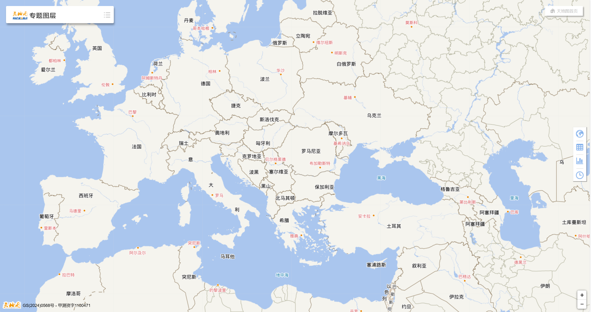
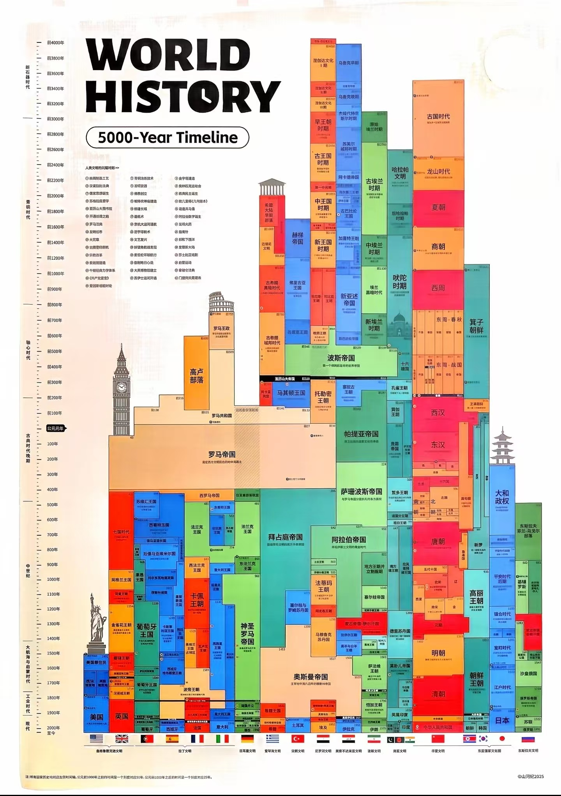

上面分别是世界分国设色图及默写图，我们学习历史必须要知道对应的国家的位置...
另外下面是地形图：记住地形可以方便推导气候和理解人类迁徙对抗的路线

## 历史概论

### I. 史学基础

*   **A. 历史的定义与性质**
    *   1.  定义：对过去的客观记录与解读，侧重于人类活动和社会发展。
    *   2.  性质：
        *   客观性与主观性的统一：史料客观存在，但解读受时代、立场影响。
        *   复杂性与规律性的统一：个体事件复杂，但总体趋势呈现规律。
        *   连续性与断裂性的统一：历史发展具有连续性，也存在革命性变革。
    *   3.  历史研究的目的：
        *   认识过去，了解现在，预测未来。
        *   总结经验教训，启迪智慧。
        *   传承文化，增强民族凝聚力。

*   **B. 史料的类型与辨析**
    *   1.  类型：
        *   文献史料：官方文件、私人书信、文学作品、报刊杂志等。
            *   特点：信息量大，但可能存在政治宣传或个人偏见。
        *   实物史料：文物古迹、生活用品、工具器械等。
            *   特点：直观可靠，但可能信息不完整，需要专业解读。
        *   口述史料：个人回忆、访谈记录、民间传说等。
            *   特点：生动形象，但可能存在记忆偏差或主观夸大。
        *   影像史料：照片、电影、录像等。
            *   特点：真实记录，但可能经过剪辑或加工，需要谨慎分析。
    *   2.  史料辨析：
        *   真实性辨别：核对史料来源，考证作者身份，对比不同史料。
        *   可靠性评估：分析作者立场，判断史料意图，注意时代背景。
        *   价值判断：评估史料对研究课题的重要性，筛选关键信息。
        *   孤证不立原则：单一史料难以支撑结论，需多方印证。

*   **C. 历史研究的方法**
    *   1.  文献研究法：查阅文献资料，进行分析、整理、归纳。
        *   重点：史料解读、观点提炼、逻辑论证。
    *   2.  考古学方法：发掘文物古迹，进行分析、鉴定、研究。
        *   重点：田野考古、文物修复、文化解读。
    *   3.  比较研究法：对比不同历史事件、人物、制度等，寻找共性与差异。
        *   重点：选择比较对象、确定比较维度、分析比较结果。
    *   4.  计量历史学：运用数学、统计学等方法，对历史数据进行分析。
        *   重点：数据收集、统计分析、趋势预测。
    *   5.  社会学历史学：运用社会学理论，分析历史事件的社会背景和影响。
        *   重点：社会结构、阶级关系、文化变迁。

### II. 历史发展阶段

*   **A. 原始社会**
    *   1.  时间：人类文明的早期阶段，从旧石器时代到新石器时代。
    *   2.  特征：
        *   生产力低下：工具简陋，主要依靠采集和狩猎。
        *   社会组织简单：血缘关系为纽带，形成氏族或部落。
        *   公有制经济：生产资料公有，平均分配劳动成果。
        *   宗教信仰原始：崇拜自然、图腾和祖先。
    *   3.  重要事件：
        *   火的使用：改变了人类的生活方式，促进了进化。
        *   农业的产生：为人类提供了稳定的食物来源，为文明的诞生奠定了基础。
        *   陶器的发明：改善了食物的储存和烹饪方式。

*   **B. 奴隶社会**
    *   1.  时间：随着生产力的发展和社会分工的出现，原始社会解体，奴隶社会形成。
    *   2.  特征：
        *   阶级分化：奴隶主阶级占有生产资料和奴隶，奴隶阶级没有任何人身自由。
        *   国家机器出现：维护奴隶主统治，镇压奴隶反抗。
        *   私有制经济：生产资料归奴隶主所有。
        *   文明初步发展：青铜器、文字、城市等出现。
    *   3.  重要文明：
        *   古埃及文明：金字塔、象形文字、太阳历。
        *   古巴比伦文明：《汉谟拉比法典》、楔形文字。
        *   古印度文明：种姓制度、佛教。
        *   古希腊文明：民主制度、哲学、文学。

*   **C. 封建社会**
    *   1.  时间：奴隶社会崩溃后，封建社会逐渐形成。
    *   2.  特征：
        *   土地所有制：地主或领主占有土地，农民或农奴依附于土地。
        *   等级制度：社会等级森严，不同等级享有不同的权利和义务。
        *   中央集权或地方分权：国家权力分配形式多样。
        *   农业经济为主：农业是主要的经济来源。
    *   3.  重要事件：
        *   中国秦朝的统一：建立了中央集权的封建国家。
        *   欧洲中世纪的庄园制度：形成了独特的封建社会形态。
        *   文艺复兴：促进了欧洲思想文化的解放。

*   **D. 资本主义社会**
    *   1.  时间：随着生产力的进一步发展，资本主义逐渐取代封建主义。
    *   2.  特征：
        *   资本所有制：资本家占有生产资料，工人出卖劳动力。
        *   市场经济：资源配置主要依靠市场机制。
        *   民主政治：普遍推行代议制民主。
        *   工业化：机器大生产取代手工劳动。
    *   3.  重要事件：
        *   英国工业革命：开启了工业化的进程。
        *   法国大革命：摧毁了法国的封建统治，传播了自由、平等、博爱的思想。
        *   两次世界大战：对世界格局产生了深刻影响。
        *   冷战：美苏争霸，世界分裂为两大阵营。

*   **E. 社会主义社会**
    *   1.  时间：在一些国家，无产阶级通过革命建立了社会主义制度。
    *   2.  特征：
        *   生产资料公有制：生产资料归全体人民或集体所有。
        *   计划经济与市场经济相结合：国家调控与市场机制共同发挥作用。
        *   人民民主专政：保障人民的民主权利。
        *   共同富裕：追求社会公平和共同发展。
    *   3.  重要事件：
        *   俄国十月革命：建立了世界上第一个社会主义国家。
        *   中国革命：建立了中华人民共和国，走上了社会主义道路。
        *   改革开放：中国社会主义建设进入新阶段。

### III. 历史研究的视角

*   **A. 政治史**
    *   1.  研究内容：国家制度、政权更迭、政治事件、政治人物等。
    *   2.  重点：权力斗争、政策制定、外交关系、意识形态。
    *   3.  代表人物：希罗多德、修昔底德、司马迁。

*   **B. 经济史**
    *   1.  研究内容：生产力发展、经济制度、贸易活动、经济危机等。
    *   2.  重点：生产关系、资源分配、市场运作、技术进步。
    *   3.  代表人物：亚当·斯密、卡尔·马克思、马克思·韦伯。

*   **C. 社会史**
    *   1.  研究内容：社会结构、阶级关系、生活方式、社会运动等。
    *   2.  重点：社会分层、文化习俗、人口流动、社会保障。
    *   3.  代表人物：汤因比、布罗代尔、霍布斯鲍姆。

*   **D. 文化史**
    *   1.  研究内容：思想文化、宗教信仰、艺术创作、科技发展等。
    *   2.  重点：文化交流、知识传播、价值观念、审美情趣。
    *   3.  代表人物：贡布里希、李约瑟、钱钟书。

*   **E. 思想史**
    *   1.  研究内容：哲学思想、政治思想、伦理思想等。
    *   2.  重点：思想流派、代表人物、理论体系、社会影响。
    *   3.  代表人物：柏拉图、亚里士多德、孔子、老子。

### IV. 历史的启示

*   **A. 发展是永恒的主题**
    *   1.  历史证明，只有不断发展，才能适应时代变化，解决社会问题。
    *   2.  发展需要创新，包括理论创新、制度创新、科技创新等。

*   **B. 改革是进步的动力**
    *   1.  历史证明，固步自封只会导致落后，改革是推动社会进步的必要手段。
    *   2.  改革需要勇气和智慧，要结合实际情况，循序渐进。

*   **C. 和平是繁荣的保障**
    *   1.  历史证明，战争只会带来破坏和痛苦，和平是发展的前提。
    *   2.  要维护世界和平，促进各国合作，构建人类命运共同体。

*   **D. 文化是民族的根基**
    *   1.  历史证明，文化是一个民族的灵魂，要传承和弘扬优秀传统文化。
    *   2.  要尊重不同文明的多样性，加强文化交流，促进共同发展。

*   **E. 人民是历史的创造者**
    *   1.  历史证明，人民群众是推动社会进步的根本力量。
    *   2.  要坚持以人民为中心的发展思想，实现人民对美好生活的向往。

### V. 历史时间轴（待修改整理）

| **时间轴**                                  | **欧洲**                             | **西亚（两河/波斯）**            | **中亚**                    | **南亚（印度）**                      | **东亚（中国）**                       |
| ---------------------------------------- | ---------------------------------- | ------------------------ | ------------------------- | ------------------------------- | -------------------------------- |
| **史前及早期文明**  (公元前3500 - 1000)      | 米诺斯文明、迈锡尼文明（爱琴文明）                  | 苏美尔、古巴比伦、古埃及、赫梯          | 游牧部落起源   （印欧人迁徙） | 哈拉帕文明   （印度河文明）        | 夏、商、西周     （青铜文明早期）     |
| **古典文明时期**    (公元前1000 - 公元500)    | **古希腊、罗马帝国**     （共和制到帝国） | 波斯帝国、希腊化时代、帕提亚           | 匈奴、大月氏、贵霜帝国               | **孔雀王朝、笈多王朝**  （佛教与印度教定型） | **秦汉帝国**  （大一统与儒家化）        |
| **中古及全球趋同**  (公元500 - 1500)        | 中世纪黑暗时代、封建制度、十字军东征                 | **阿拉伯帝国（倭马亚/阿拔斯）**、奥斯曼兴起 | 突厥汗国、蒙古帝国、帖木儿帝国           | 戒日王朝、德里苏丹国                      | **隋唐宋元明**  （科举、四大发明、+蒙古征服） |
| **西方崛起/早期近代**     (1500 - 1914) | **文艺复兴、大航海、工业革命、资产阶级革命**           | **奥斯曼土耳其帝国**、萨非王朝        | 准噶尔汗国、俄罗斯扩张影响             | **莫卧儿帝国**、英国东印度公司殖民             | 清朝    （从鼎盛到晚清衰落）           |
| **全球一体化时代**  (1914 - 至今)           | 两次大战、欧盟、冷战与后冷战时期                   | 奥斯曼瓦解、现代中东国家体系           | 苏联加盟共和国、中亚五国独立            | 印度独立、印巴分治                       | 中华民国、中华人民共和国                     |

| **世纪**      | **欧洲（希腊/罗马/近代）** | **西亚（两河/波斯/奥斯曼）**  | **中亚**         | **南亚（印度）**       | **东亚（中国）**       |
| ----------- | ---------------- | ------------------ | -------------- | ---------------- | ---------------- |
| **BC 10C**  | 希腊黑暗时代结束         | 新亚述帝国兴起            | 游牧部落开始扩张       | 吠陀时代后期           | 西周（礼乐制度）         |
| **BC 8-6C** | 希腊城邦崛起/罗马建城      | **居鲁士建立波斯帝国**      | 斯基泰人兴起         | 16国时代/佛教诞生       | 春秋时代（百家争鸣）       |
| **BC 4C**   | 亚历山大帝国           | 希腊化时代开始            | 亚历山大东征冲击       | **孔雀王朝（阿育王）**    | 战国（商鞅变法）         |
| **BC 2C**   | 罗马向地中海扩张         | 帕提亚（安息）帝国          | 匈奴崛起/大月氏迁徙     | 巽伽王朝（佛教受压制）      | **西汉（丝绸之路）**     |
| **BC 1C**   | **罗马共和国转为帝国**    | 罗马与安息对峙            | 西域都护府设立        | 萨塔瓦哈纳王朝          | 汉武帝鼎盛时期          |
| **1-2C**    | **罗马帝国“黄金时代”**   | 罗马、波斯、贵霜、汉并立       | **贵霜帝国**（中介地位） | 贵霜帝国统治北印         | 东汉（蔡伦造纸）         |
| **3-4C**    | 罗马帝国分裂/基督教合法化    | 萨珊波斯崛起             | 嚈哒人（白匈奴）扩张     | **笈多王朝**（古典黄金时代） | 三国/晋（五胡乱华）       |
| **5-6C**    | **西罗马灭亡**/拜占庭繁荣  | 萨珊波斯鼎盛             | 突厥汗国兴起         | 笈多瓦解/白匈奴入侵       | 南北朝 / **隋朝统一**   |
| **7-8C**    | 查理曼帝国/维京海盗       | **阿拉伯帝国（倭马亚/阿拔斯）** | 突厥分裂/阿拉伯入侵     | 拉其普特时期           | **唐朝（盛世与安史之乱）**  |
| **9-10C**   | 封建制度成熟           | 阿拔斯衰落/塞尔柱兴起        | 喀喇汗国（萨曼王朝）     | 印度教复兴/伊斯兰南下      | 五代十国 / 北宋建立      |
| **11-12C**  | 大学兴起/哥特式建筑       | 十字军东征 / 塞尔柱帝国      | 西辽兴起           | 德里苏丹国建立          | 宋朝（经济革命/指南针）     |
| **13-14C**  | 黑死病/文艺复兴萌芽       | **蒙古灭阿拔斯/帖木儿**     | 察合台汗国/金帐汗国     | 德里苏丹国鼎盛          | **元朝（蒙古征服）**     |
| **15C**     | **地理大发现/文艺复兴**   | **奥斯曼攻占君士坦丁堡**     | 帖木儿帝国瓦解        | 莫卧儿帝国前夜          | 明朝（郑和下西洋）        |
| **16C**     | 宗教改革/西班牙霸权       | 萨非波斯帝国兴起           | 乌兹别克汗国         | **莫卧儿帝国建立**      | 明朝（张居正改革）        |
| **17C**     | **科学革命/启蒙运动**    | 奥斯曼扩张受阻            | 准噶尔部兴起         | 莫卧儿鼎盛（泰姬陵）       | 清朝入关 / 康熙        |
| **18C**     | **工业革命/美国独立**    | 奥斯曼帝国衰落            | 俄罗斯势力侵入        | 莫卧儿瓦解/英国渗透       | 清朝鼎盛（乾隆）         |
| **19C**     | 民族主义/维多利亚时代      | 帝国主义瓜分中东           | 俄英“大博弈”        | **英国正式殖民统治**     | **晚清衰落（鸦片战争）**   |
| **20C**     | 两次世界大战/冷战/欧盟     | 以巴冲突/石油政治          | 苏联时期 / 五国独立    | 独立与印巴分治          | **辛亥革命/建国/改革开放** |

## 世界历史（最初版本）

### 一、古代文明 (约公元前3500年 - 公元500年)

*   **1.1 早期文明 (公元前3500年 - 公元前1500年)**
    *   **1.1.1 两河流域文明 (美索不达米亚)**
        *   地理位置：底格里斯河、幼发拉底河流域
        *   主要文明：苏美尔文明、阿卡德王国、巴比伦王国（古巴比伦、新巴比伦）、亚述帝国
        *   重要成就：楔形文字、汉谟拉比法典、灌溉技术、数学、天文学
        *   衰落：被外族征服
    *   **1.1.2 古埃及文明**
        *   地理位置：尼罗河流域
        *   政治制度：法老统治、金字塔
        *   重要成就：象形文字、金字塔建筑、木乃伊制作、数学、医学
        *   衰落：被外族征服
    *   **1.1.3 古印度文明 (印度河流域文明)**
        *   地理位置：印度河流域
        *   主要城市：哈拉帕、摩亨佐-达罗
        *   重要成就：城市规划、排水系统、农业
        *   衰落：原因不明，可能与气候变化或外族入侵有关
    *   **1.1.4 古代中国文明**
        *   地理位置：黄河流域、长江流域
        *   朝代：夏朝（传说）、商朝、周朝
        *   重要成就：甲骨文、青铜器、农业
        *   哲学：儒家思想、道家思想
        *   衰落：周朝礼崩乐坏，进入春秋战国时期

*   **1.2 古典文明 (公元前1500年 - 公元500年)**
    *   **1.2.1 古希腊文明**
        *   地理位置：巴尔干半岛、爱琴海诸岛（今希腊）
        *   城邦制度：雅典（民主政治）、斯巴达（军国主义）
        *   重要成就：哲学 (苏格拉底、柏拉图、亚里士多德)、文学 (荷马史诗)、科学 (数学、天文学、医学)、民主制度、奥林匹克运动会
        *   战争：希波战争、伯罗奔尼撒战争
        *   亚历山大帝国：希腊文化的传播
        *   衰落：被罗马征服
    *   **1.2.2 古罗马文明**
        *   起源：意大利半岛（又称亚平宁半岛）
        *   政治制度：罗马共和国、罗马帝国
        *   扩张：征服地中海地区
        *   重要成就：法律 (罗马法)、建筑 (竞技场、万神殿)、工程 (道路、水渠)、拉丁语
        *   基督教：起源于罗马帝国，后成为国教
        *   衰落：西罗马帝国灭亡，东罗马帝国（拜占庭帝国）继续存在

### 二、中世纪时期 (约公元500年 - 1500年)

*   **2.1 欧洲**
    *   **2.1.1 西欧封建社会**
        *   政治制度：封君封臣制度、庄园经济
        *   教会：罗马天主教会的统治
        *   文化：宗教文化为主导
        *   十字军东征
        *   城市兴起：促进了商业和手工业的发展
        *   大学的兴起
    *   **2.1.2 东欧：拜占庭帝国**
        *   延续：东罗马帝国的延续
        *   文化：融合了希腊、罗马、基督教文化
        *   法律：查士丁尼法典
        *   衰落：被奥斯曼土耳其帝国征服
    *   **2.1.3 东欧：斯拉夫文明**
        *   罗斯：基辅罗斯，受拜占庭文化影响
        *   俄罗斯：逐渐崛起

*   **2.2 亚洲**
    *   **2.2.1 中国**
        *   朝代：隋、唐、宋、元、明
        *   政治制度：科举制、中央集权
        *   文化：佛教、道教、儒家思想
        *   科技：四大发明
        *   经济：农业发达，丝绸之路贸易繁荣
    *   **2.2.2 阿拉伯帝国 (伊斯兰文明)**
        *   兴起：伊斯兰教的创立和传播
        *   扩张：征服中东、北非、西班牙
        *   文化：保存和发展了古代希腊、罗马的文化，并有创新
        *   数学：阿拉伯数字
        *   科学：医学、天文学
        *   衰落：分裂
    *   **2.2.3 日本**
        *   大化改新：学习中国唐朝制度
        *   幕府政治：武士阶层掌握实权
    *   **2.2.4 印度**
        *   笈多帝国
        *   德里苏丹国
        *   莫卧儿帝国

*   **2.3 美洲**
    *   玛雅文明
    *   阿兹特克文明
    *   印加文明

### 三、近代时期 (约1500年 - 1900年)

*   **3.1 变革与转型**
    *   **3.1.1 文艺复兴**
        *   背景：资本主义萌芽
        *   核心思想：人文主义
        *   代表人物：达芬奇、米开朗基罗、拉斐尔、莎士比亚
        *   影响：促进了思想解放，为宗教改革和科学革命奠定了基础
    *   **3.1.2 宗教改革**
        *   马丁·路德：新教改革
        *   加尔文：加尔文教
        *   影响：打击了天主教会的权威，促进了民族国家的形成
    *   **3.1.3 地理大发现**
        *   原因：商业危机、传播宗教
        *   航海家：哥伦布、达伽马、麦哲伦
        *   影响：世界连成一个整体，促进了商品贸易和文化交流，但也带来了殖民掠夺

*   **3.2 资本主义的兴起**
    *   **3.2.1 英国资产阶级革命**
        *   原因：斯图亚特王朝的专制统治
        *   过程：内战、共和国、复辟、光荣革命
        *   结果：《权利法案》，确立了君主立宪制
    *   **3.2.2 美国独立战争**
        *   原因：英国的殖民统治
        *   过程：《独立宣言》、战争
        *   结果：美国独立，建立联邦共和国
    *   **3.2.3 法国大革命**
        *   原因：封建专制统治
        *   过程：《人权宣言》、革命、拿破仑帝国
        *   影响：摧毁了法国的封建制度，传播了革命思想

*   **3.3 工业革命**
    *   **3.3.1 第一次工业革命**
        *   开始：英国
        *   动力：蒸汽机
        *   影响：工厂制度的建立，城市化进程加快
    *   **3.3.2 第二次工业革命**
        *   动力：电力、内燃机
        *   影响：电气时代，重工业发展，垄断组织出现

*   **3.4 殖民扩张**
    *   原因：资本主义发展的需要
    *   主要国家：英国、法国、西班牙、葡萄牙、荷兰
    *   影响：殖民地人民遭受压迫和剥削，但同时也促进了殖民地地区的现代化进程

### 四、现代时期 (约1900年 - 至今)

*   **4.1 两次世界大战**
    *   **4.1.1 第一次世界大战**
        *   原因：帝国主义矛盾
        *   导火索：萨拉热窝事件
        *   结果：同盟国战败，凡尔赛-华盛顿体系
    *   **4.1.2 第二次世界大战**
        *   原因：经济危机、法西斯主义的兴起
        *   导火索：德国入侵波兰
        *   结果：法西斯国家战败，联合国成立

*   **4.2 冷战**
    *   原因：美国和苏联的意识形态对立
    *   表现：军备竞赛、代理人战争
    *   结果：苏联解体，冷战结束

*   **4.3 全球化**
    *   原因：科技进步、经济发展
    *   表现：贸易自由化、投资便利化、信息传播加速
    *   影响：促进了经济发展，但也带来了贫富差距扩大、环境问题等挑战

*   **4.4 当代世界**
    *   多极化趋势
    *   地区冲突
    *   恐怖主义
    *   气候变化
    *   科技革命

## 世界历史

### 一、古代文明 (约公元前3500年 - 公元500年)

#### 1.1 早期文明 (公元前3500年 - 公元前1500年)

##### 1.1.1 两河流域文明 (美索不达米亚)

**建立**：公元前3500年左右，苏美尔人在底格里斯河与幼发拉底河下游冲积平原建立城邦。依托定期泛滥的河水发展灌溉农业，形成 surplus 经济，支撑了祭司阶层和专业化分工。

**发展脉络**：
- **苏美尔时期** (前3500-前2334)：发明楔形文字（人类最早文字系统之一），建立乌尔、乌鲁克等城邦，发展六十进制数学
- **阿卡德王国** (前2334-前2193)：萨尔贡一世首次统一两河流域，建立中央集权
- **乌尔第三王朝** (前2112-前2004)：颁布《乌尔纳姆法典》（比汉谟拉比法典更早）
- **古巴比伦** (前1894-前1595)：汉谟拉比统一两河，颁布《汉谟拉比法典》，确立"以眼还眼"原则，天文学取得突破
- **亚述帝国** (前911-前609)：军事帝国，建立图书馆系统，使用铁器
- **新巴比伦** (前626-前539)：尼布甲尼撒二世建造空中花园，攻陷耶路撒冷

**衰落**：公元前539年，波斯帝国居鲁士大帝攻陷巴比伦，两河流域丧失独立地位。此后相继被波斯、希腊塞琉古、帕提亚、萨珊波斯统治，文明特征逐渐消融于波斯文化中。地理上缺乏天然屏障、过度灌溉导致土壤盐碱化、游牧民族持续压力是衰落的深层原因。

---

##### 1.1.2 古埃及文明

**建立**：公元前3100年左右，那尔迈（美尼斯）统一上下埃及，建立第一王朝。尼罗河定期泛滥带来肥沃黑土，形成"河谷专制主义"——法老作为神王统治，掌握农业周期解释权。

**发展脉络**：
- **早王朝与古王国** (前3100-前2181)：金字塔时代，乔赛尔阶梯金字塔、吉萨三大金字塔建成，确立来世信仰与木乃伊技术
- **中王国** (前2055-前1650)：重新统一，文学黄金时代，扩大对努比亚和黎凡特的贸易
- **新王国** (前1550-前1077)：帝国时期，图特摩斯三世、拉美西斯二世扩张疆域，阿蒙霍特普四世推行一神教改革（崇拜阿吞），图坦卡蒙恢复多神教
- **后期埃及** (前664-前30)：相继被亚述、波斯、希腊托勒密王朝统治，克娄巴特拉七世末代法老

**衰落**：公元前30年，屋大维击败安东尼与克娄巴特拉，埃及成为罗马行省。衰落原因包括：尼罗河泛滥不规律导致饥荒、祭司阶层权力膨胀削弱王权、铁器时代军事技术落后、缺乏有效继承制度引发内战。象形文字在公元4世纪后无人使用，直到1822年商博良破译罗塞塔石碑。

---

##### 1.1.3 古印度文明 (印度河流域文明)

**建立**：公元前2600-前1900年，印度河流域出现成熟城市文明。摩亨佐-达罗和哈拉帕规划整齐，拥有网格状街道、标准化砖块、完善的排水系统（包括家庭厕所和公共浴池），显示强大的中央规划能力。

**特征**：印章文字至今未破译，无法直接了解其政治宗教；农业依赖印度河泛滥；与两河流域存在海上贸易（美索不达米亚文献提及"麦鲁哈"）。

**衰落**：约公元前1900年开始衰退，公元前1500年左右城市被废弃。原因可能是印度河改道或干涸（构造运动导致）、过度开垦、雅利安人入侵（有争议）。此后重心东移至恒河流域，吠陀文明兴起，种姓制度与婆罗门教形成。

---

##### 1.1.4 古代中国文明

**建立**：黄河流域仰韶文化、龙山文化奠定基础。约公元前2070年（传统纪年）夏朝建立，二里头文化可能是其考古遗存。

**发展脉络**：
- **商朝** (前1600-前1046)：甲骨文成熟，青铜礼器铸造达到高峰（司母戊鼎），神权政治，频繁占卜
- **西周** (前1046-前771)：周公制礼作乐，分封制与宗法制结合，确立"天命"观念，国人暴动（前841年中国确切纪年之始）
- **春秋战国** (前770-前221)：礼崩乐坏，诸侯争霸，铁器牛耕推广，百家争鸣（儒、道、墨、法等），郡县制萌芽

**关键转折**：周平王东迁（前770）标志西周结束，王畿缩小导致礼乐征伐自诸侯出。诸子百家回应社会剧变：孔子恢复周礼，老子无为而治，韩非子法治集权。公元前221年秦统一，但思想统一迟至汉武帝"罢黜百家"（前134）。

---

#### 1.2 古典文明 (公元前1500年 - 公元500年)

##### 1.2.1 古希腊文明

**建立**：公元前2000年左右印欧语系民族迁入，前800年城邦（polis）制度形成。多山地形与海岸线导致政治分裂，但共同语言、宗教（奥林匹斯诸神）和竞技（奥林匹克运动会）维系文化认同。

**发展脉络**：
- **古风时代** (前800-前480)：殖民运动（地中海黑海沿岸），字母文字改造腓尼基字母，僭主政治过渡
- **古典时代** (前480-前323)：希波战争（马拉松、温泉关、萨拉米斯）击退波斯，雅典提洛同盟 vs 斯巴达伯罗奔尼撒同盟，伯里克利时代民主政治巅峰（公民大会、陪审团、津贴制），帕特农神庙建造
- **哲学与科学**：苏格拉底追问伦理定义，柏拉图理念论与学园，亚里士多德逻辑学与吕克昂学园；希波克拉底医学，欧几里得几何，阿基米德力学
- **马其顿崛起**：腓力二世统一希腊，亚历山大东征（前334-前323）建立地跨欧亚非帝国，传播希腊文化（Hellenism）

**衰落**：亚历山大死后帝国分裂为托勒密、塞琉古、马其顿三国。公元前168年马其顿战败于罗马，公元前146年科林斯陷落，希腊成为罗马行省。衰落内因：城邦间持续战争消耗（伯罗奔尼撒战争）、民主政治民粹化、奴隶制经济缺乏技术创新动力。但希腊文化被罗马吸收，成为古典教育核心。

---

##### 1.2.2 古罗马文明

**建立**：传统纪年前753年罗慕路斯建城，实则前8-前7世纪拉丁部落聚居。前509年驱逐塔克文，建立共和国（Res Publica），元老院、执政官、公民大会分权。

**发展脉络**：
- **共和扩张** (前509-前27)：三次布匿战争（前264-前146）击败迦太基，马其顿战争征服希腊，高卢战争（凯撒），内战（凯撒-庞培，后三头同盟），疆域环绕地中海
- **帝国转型**：前27年屋大维获"奥古斯都"称号，共和形式保留，皇帝掌握军队和行省，"罗马治下的和平"（Pax Romana，前27-180）繁荣期
- **制度成就**：罗马法（公民法-万民法-自然法演变，查士丁尼法典编纂），道路网（"条条大路通罗马"），高架引水渠，混凝土建筑（万神殿穹顶），拉丁语成为学术与行政语言
- **基督教**：1世纪起源于犹太地区，313年《米兰敕令》合法化，380年狄奥多西一世定为国教

**衰落与分裂**：
- **3世纪危机** (235-284)：军事政变频繁，通货膨胀，帝国短暂分裂
- **戴克里先改革** (284-305)：四帝共治，行政军事重组，物价管制
- **君士坦丁迁都** (330)：新罗马（君士坦丁堡）建立，帝国重心东移
- **西罗马灭亡**：476年日耳曼将领奥多亚克废黜末代皇帝罗慕路斯·奥古斯都，西欧进入中世纪。东罗马帝国（拜占庭）延续至1453年

**衰落原因**：军队蛮族化与雇佣兵依赖、奴隶制经济停滞、东西部经济文化差异、基督教对传统罗马价值的冲击、过度扩张导致行政成本激增、气候变化与蛮族迁徙压力（匈人西进推动日耳曼部落涌入）。

---

### 补充说明：文明比较视角

**建立模式的差异**：大河文明（埃及、两河、印度河、中国）依赖灌溉农业，形成专制王权与祭司阶层；海洋文明（希腊）依托贸易与殖民，发展出城邦民主。

**衰落机制的共性**：生态压力（土壤退化、河流改道）、军事技术扩散（游牧民族掌握铁器）、内部社会矛盾（债务奴隶、土地集中）、治理成本超过收益（过度扩张）。

**延续性的对比**：中国文明通过秦汉帝国实现政治文化整合，保持连续性；地中海世界经历希腊-罗马-基督教-日耳曼的多层叠加，形成断裂与转型。