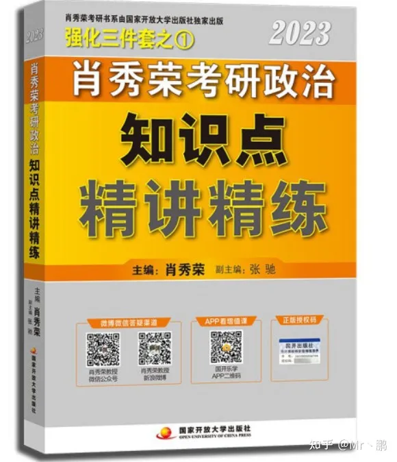
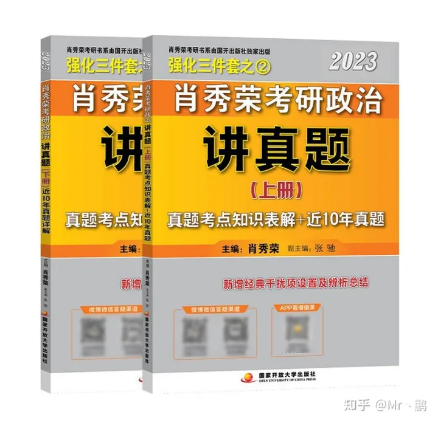
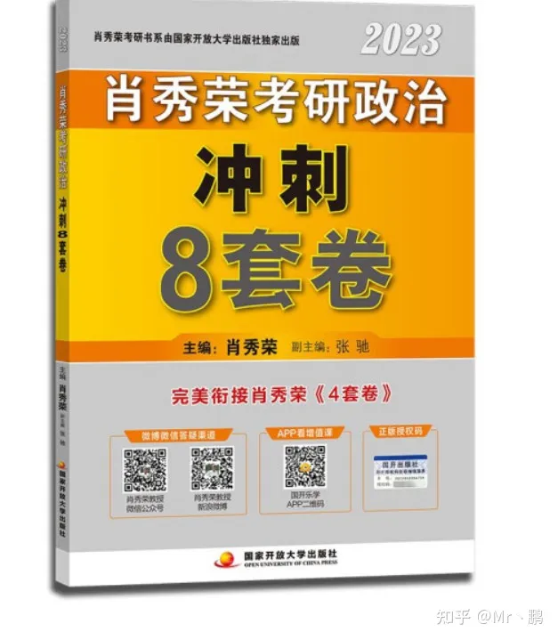
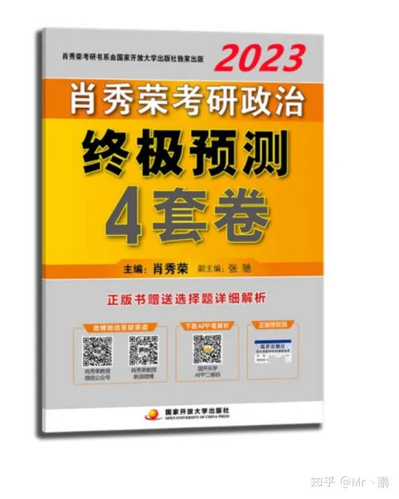
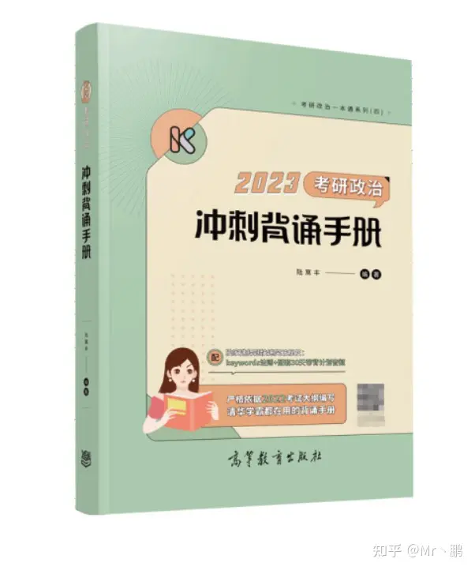
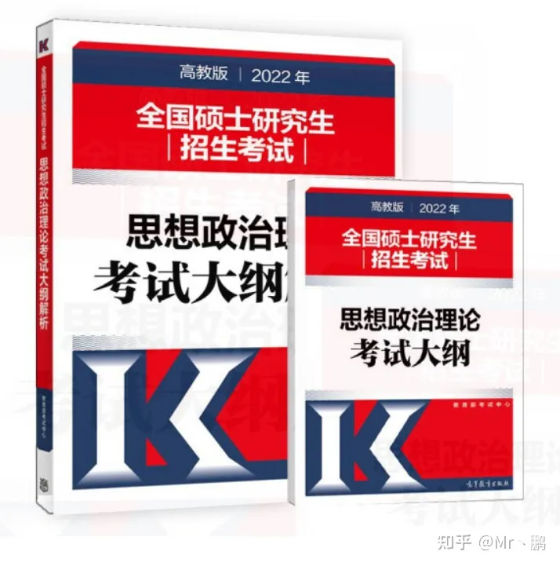

## 前言

> 对于政治这门学科，一般而言都将其复习都是放在考研整个阶段的后期进行；但是，这并不代表政治这一学科的复习规划和复习准备就不重要！
> 正是由于政治学科复习有着这一鲜明特点——**“时间紧，任务重”**；因此，政治的复习更加讲究**“高效的复习方式，合理的复习机制”**，我们需要学会：**如何在较短的时间内掌握较多的基础知识与解题方法**，从而才能高效地开展政治科目的复习。

## 一、考试分析

### **1. 考察学科范围**

《马克思主义基本原理概论》——**约24%**

《毛泽东思想和中国特色社会主义理论体系概论》——**约30%**

《中国近现代史纲要》——**约14%**

《思想道德修养与法律基础》——**约16%**

《形势与政策以及当代世界经济与政治》——**约16%**

> ***分析：可以看出，政治对大学阶段的四门思政类学科都有考查，其中以“毛概”居于首位，占比达到30%；而紧随其后的“马原”，占比也达到24%；其他的三门课占比则相当，均为14%-16%。因此，复习时应该清楚各个学科的占比，做到心中有数。\***

### 2. 试卷题型及分值

单项选择题——**16分 (16小题，每题1分，题号1-16)**

多项选择题——**34分 (17小题，每题2分，题号17-33)**

分析题——**50分 (5大题，每题10分，题号34-38)**

> ***分析：政治这一科目试题分布为“单选”，“多选”，“分析题”，且分值占比逐一增大。可以看出考研政治对于概念的考查和考生思政类辩证思维考查较深——多选题的占比是单选题的两倍，且分析题占比为50%。因此，复习时要特别注意多选题的选项设置，考察要点以及非常重要的主观题答题模板和答题思路！\***

### **3. 各学科对应试题题号**

**①** **马克思主义基本原理**

- l 单选题：**第1—4题**
- l 多选题：**第17—21题**
- l 分析题：**第34题**

**②** **毛泽东思想和中国特色社会主义理论体系概论**

- l 单选题：**第5—8题**
- l 多选题：**第22—26题**
- l 分析题：**第35题**

**③** **中国近现代史纲要**

- l 单选题：**第9—12题**
- l 多选题：**第27—29题**
- l 分析题：**第36题**

**④ 思想道德修养与法律**

- l 单选题：**第13—14题**
- l 多选题：**第30—31题**
- l 分析题：**第37题**

**⑤ 形势与政策以及当代世界经济与政治**

- l 单选题：**第15——16题（15：国内时政 16：国外时政）**
- l 多选题：**第32——33题（32：国内时政 33：国外时政）**
- l 分析题：**第38题 （38：当代世界经济与政治）**

> ***分析：从题目的设置可以看出，试卷整体是按照“马原——毛概——近代史——思修——形势与政策”的模式出题的，并且单选题、多选题、分析题的分布也和考查内容占比相符，因此在复习时可以参照试卷题型分布的特点来计划各个科目的复习顺序。\***

------

## 二、复习资料

### **1. Part 1：肖秀荣系列**

**①肖秀荣精讲精练**

> 只要稍微了解过考研政治的人，相信都应该听说过肖秀荣的大名，**堪称考研政治界的权威。**但是，近些年来对于这本精讲精练褒贬不一，因为它更适合于政治备考时间较多的同学，**知识点内容全面细致、可以直接替代教材复习是它最大的特点；但与此同时，想要完全吃透它也需要花费较多的时间。**
> 所以，精讲精练的选择根据备考时间决定，这里给个参考时间：**建议最迟9月份开始。**

肖秀荣：精讲精练（三件套①）

**②肖秀荣1000题**

> 肖秀荣1000题，相信就不用多做介绍了，**几乎人手一本的必备习题册，可以说是考研政治必买书籍中的No.1**，其重要性就不用过多赘述了。这里再说一下使用方法，**1000题是非常适合和精讲精练搭配使用的**，每看完一节精讲精练就及时复习刷1000题的相应部分，复习效果非常棒。同时，**1000题的答案解析特别详细，并且还会对应到精讲精练的具体知识点和页码索引**，这两者可谓是绝配了！

肖秀荣：1000题（三件套③）

**③肖秀荣讲真题**

> 讲真题是一本用来讲解政治历年真题，分析命题人命题思路的资料。对于政治这一学科而言，真题的作用不是特别大，这里不作特别推荐。但还是讲一下有关讲真题的使用，**讲真题可以用于刷完精讲精练，1000题后作为研究历年出题特点以及了解分析题大题套路使用。**

***注：如若政治学科复习时间不足，可跳过此本资料，以后期模拟题、押题卷为主！！！\***

肖秀荣：讲真题（三件套②）

**④ 肖秀荣冲刺8套卷（肖八）**

> 肖秀荣冲刺8套卷，简称肖八，是肖秀荣部分最为精华也是最为传神的资料了，其重要程度与1000题相当，甚至还在其之上，因为这可是押题卷啊！最后阶段押题背题背套路全都靠他了。**总而言之，必买！必买！必买！重要的话说三遍！**

***注：该本资料非常重要，建议一定要入手一本！！！\***

***使用方法：肖八建议选择题全部刷一遍并且吃透！大题要尽量多背多记！\***

肖秀荣：冲刺8套卷（肖八）

**⑤肖秀荣终极预测4套卷（肖四）**

> 肖秀荣终极预测4套卷，简称肖四，其重要程度与肖八相当，肖四一般在肖八之后出版，大概时间当年12月初，可以说是最后阶段的最后一套资料了，非常非常重要！**还是那句话，必买！必买！必买！重要的话说三遍！**

***注：肖四的优先级比肖八更高，建议两套书结合一起使用！！！\***

***使用方法：肖四，必须全部做完！并且全部背完！都到了最后时刻了，肖四必须完全吃透，容不得半点马虎！\***

肖秀荣：终极预测4套卷（肖四）

### 2. Part 2：徐涛系列

**①徐涛：考研政治核心考案**

> 徐涛老师出的书最大的优点就是**知识点和框架构图特别精美**，整本书看上去就两个字：好看！除此之外，**核心考案的“易混点”和“疑难知识点”也做的比较好**，可以作为精讲精练的补充资料。

**使用方法：在精讲精练的学习中，穿插着核心考案的学习，以精讲精练为主，核心考案为辅。**

徐涛：核心考案（可搭配网课学习）

**②徐涛考前预测必背20题（小黄书）**

> 这本书也是考研政治中经常被推荐的资料，适合政治复习后期（11-12月），结合肖四肖八一起背诵。并**且徐涛的这小黄书答案写的很好，而且有逻辑，内容看着很多，其实背起来比肖八好背的多。**这里一定要注意，**背诵指的是背知识点，而不是背诵原题！**考试不可能直接出原题给你，但是当你掌握了知识点，无论怎么出题都会写才是王道。

**使用建议：最后冲刺阶段，结合肖四肖八一起使用。一定注意的是，背知识点！背知识点！背知识点！**

徐涛考前预测必背20题（小黄书）

### 3. Part 3：腿姐系列

**①2023考研政治冲刺背诵手册**

> **腿姐作为近些年来新崛起的一股势力，因其专业性的网课讲法，选择题的种种Keywords做题法，分析题的种种“大招”而深受青睐，尤其适合将政治作为“优势学科”的考研er们跟随。在这里不作比较，只做推荐。博主考研当年是在11月底才开始看腿姐的冲刺课和押题课，从此就爱上了腿姐，在这里也做一波强烈推荐。**
> **腿姐，YYDS！！！**

**使用建议：10月中旬开始使用，建议搭配网课和喜马拉雅/腿姐公众号跟背，效果更佳！！！**

腿姐介绍（强烈安利的一位“宝藏”老师）

2023考研政治冲刺背诵手册（腿姐：陆寓丰 ）

**②2023腿姐冲刺4套卷**

> **关于推荐的冲刺4套卷，褒贬不一。个人认为，如果考研政治主要跟的老师是腿姐的话，该冲刺4套卷还是必须刷的。因此腿姐的4套卷具有极为特别的个人特色，将腿姐课堂上讲过的、强调过的、易错的等知识点都呈现，结合网课以及腿姐系列资料一起食用，效果还是非常棒的。**
> **但话说回来，如果后期做完了肖八/肖四，还是可以再入手一套腿姐4套卷继续练练选择题，分析题也可以对照着研究一下。毕竟，多做一些就多一些把握，对吧？！！！**

2023腿姐冲刺4套卷

### 4. Part 4：其他系列

**① 2021考研政治大纲解析（红宝书）**

> 《2023考研政治大纲解析》（俗称“红宝书”），高等教育出版社。**考研政治界唯一，官方，权威性的资料！市面上所有的政治辅导资料，无一例外都是根据这本书改编的！**所以，这本资料也可以在考研政治的备考期间适当翻一翻，多了解一些考研政治大纲的具体要求和变化总归是没有坏事的！

考研政治大纲解析（2022版），最新版还未出 借用2022版~

**②“考研政治复习”微信小程序**

> 关于刷题，大部分人可能只知道刷纸质版的资料刷题，例如1000题、徐涛的优题库等等，但实际上小程序刷题有其最大的优势——**方便且能利用碎片时间复习。**
> 何谓碎片时间？排队打饭刷刷、蹲坑刷刷、睡前刷刷……**充分利用碎片时间刷题，人们常说“书读百遍，其义自见”，相信这个道理对于刷题同样适用！**

**③徐涛：政治强化班**

> 最后讲一下网课部分，关于政治的复习，我个人不是很推荐网课学习的，因为政治这类科目非常偏向于文科，所以最重要的当然还是记背和刷题；当然，如果政治复习开始的早的话，**可以在前期部分结合网课和精讲精练/核心考案先过一遍大概，对政治的知识体系有个大概的了解和掌握。**

徐涛老师的网课，基本上看过的人都会力荐，**因为徐涛老师讲授方式非常轻松愉悦，不会让人感到枯燥无味，看过徐涛网课后只会越看越想看！风格有点类似数学届的张宇，哈哈哈~**

yo yo~ 我先来一段Free Style~

**④腿姐：政治冲刺班&押题班**

> 虽然前面提过个人不是很推荐完全靠网课，但假如留给政治学科复习的时间不足——**我极力推荐在最后阶段（11月-12月）一定要看腿姐的冲刺课&押题课！！！**
> **腿姐的这两阶段课均是将知识点、方法以及最基本的得分法以最易吸收的方式传授，即使政治的基础复习的不是那么好，但到了最终阶段还是可以抢救一下的，相信腿姐，跟着好好上课，好好做题，好好背诵资料，政治最终及格也不是难事！**
> **腿姐，YYSD ！！！**

腿姐的絮絮念 哈哈哈~

------

## 三、复习规划

> **复习规划每个人都不尽相同，要根据每个人的基础情况、时间安排、学习效率等来综合考虑，这里只提供一个整体思路，仅供参考。**

### **1、基础阶段**

> **复习时间：8月初-9月初**
> **复习思路：徐涛网课+核心考案（核心考案可换成肖秀荣的精讲精练）/腿姐强化课+腿姐对应讲义资料复习方法：先听视频课，然后对照核心考案上的相应章节认真看一遍至两遍。**

### **2、强化阶段**

> **复习时间：9月初-10月中**
> **复习思路：肖秀荣1000题+肖秀荣精讲精练（和上面统一，选择一本即可）**
> **复习方法：这个阶段的重点是第一遍地刷肖秀荣1000题！！！同时要把精讲精练的内容再认真看一遍，并且保证每天看完后做对应的1000题。**

### **3、提升阶段**

> **复习时间：10月中-11月中**
> **复习思路：2021考研政治大纲解析（前面提到过，非常重要！）+1000题二刷**
> **复习方法：先研究大纲解析的内容，并同时做好标记将重点部分突出，然后二刷1000题。这次二刷1000题重点在于回顾第一遍的错题和难题，并尽可能把1000题全部吃透，这一步做好了后面冲刺阶段会轻松不少！**

### **4、冲刺阶段**

> **复习时间：11月中-12月底**
> **复习思路：肖八+肖四+徐涛小黄书/腿姐冲刺背诵手册+腿姐预测4套卷（可选）**
> **复习方法：最后冲刺的阶段，如果前面的复习都做的好的话，只需要专心研究肖四肖八九便足够了，同时适当穿插着背诵徐涛小黄书的重点知识点，尤其是肖四肖八和徐涛小黄书都出现过的知识点，那一定是重中之重，需要特别重视！**
