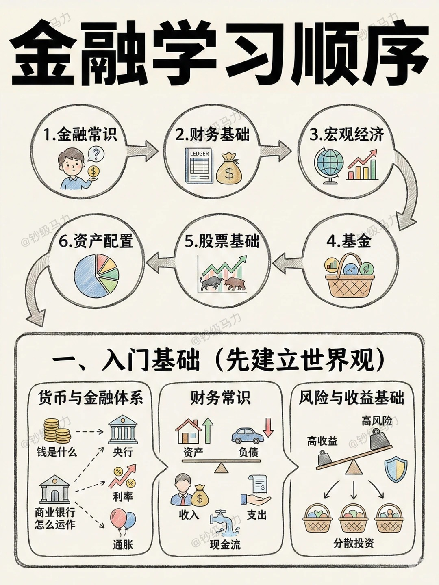
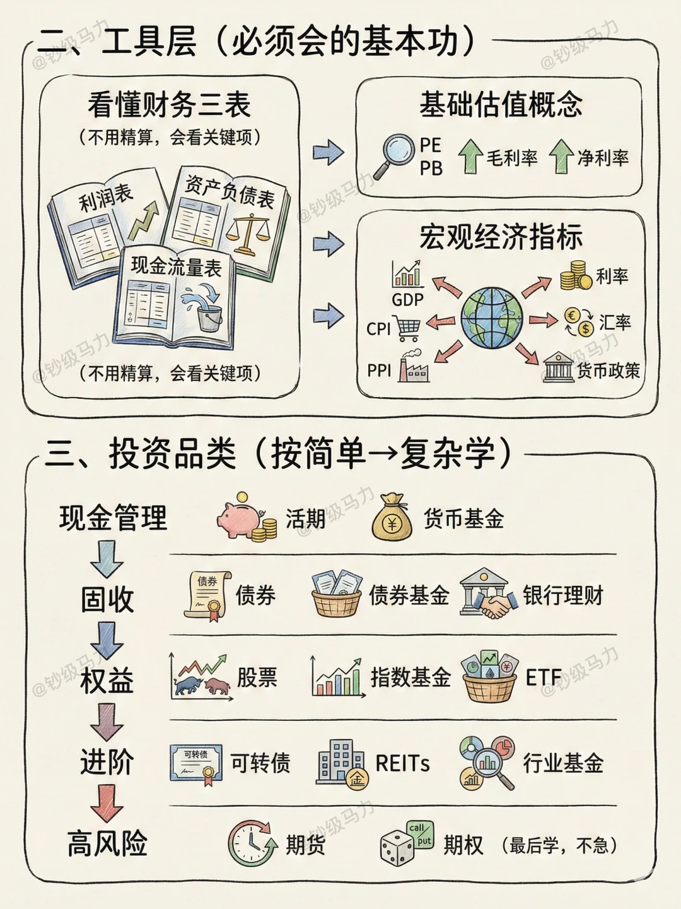
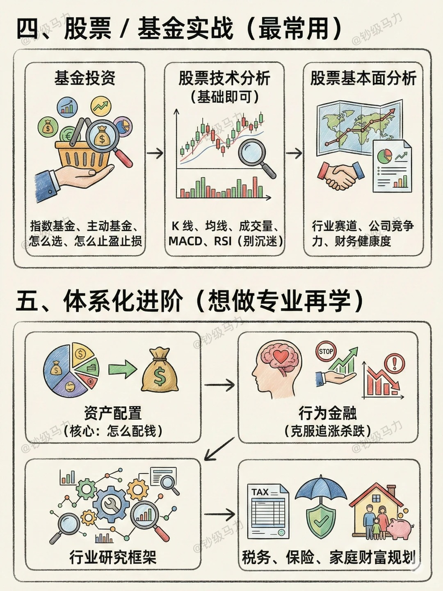

# 经济学vs金融学

经济学与金融学的核心差异在于**研究问题的边界**与**分析范式**。金融学源于经济学，但已发展成为具有独立理论内核的学科。

---

## 一、学科定位关系

```
经济学（Economics）
├── 理论经济学
│   ├── 微观经济学（价格理论）
│   ├── 宏观经济学（增长与波动）
│   └── 政治经济学
└── 应用经济学
    ├── 金融学（Finance） ← 独立程度最高的分支
    ├── 财政学
    ├── 产业经济学
    └── 国际贸易学
```

**关键事实**：在中国学科体系中，金融学是应用经济学下的二级学科（代码020204），但研究范式与师资构成已高度独立，顶尖高校（如清华五道口、北大光华）的金融系通常与经济系并列而非从属。

---

## 二、核心维度对比

| 维度 | 经济学（Economics） | 金融学（Finance） |
|------|-------------------|-----------------|
| **研究对象** | 稀缺资源的配置与利用 | 风险与跨期价值的配置 |
| **核心问题** | 生产什么？如何生产？为谁生产？ | 资产如何定价？风险如何管理？价值如何跨期转移？ |
| **时间维度** | 长期均衡、稳态增长 | 跨期选择、短期定价、现金流折现 |
| **分析单位** | 消费者、企业、政府、市场 | 投资者、资产组合、公司、金融机构 |
| **均衡概念** | 一般均衡（供需平衡） | 无套利均衡（Law of One Price） |
| **核心数学工具** | 微积分、优化理论、博弈论 | 随机过程、测度论、偏微分方程（Black-Scholes） |
| **数据性质** | 宏观经济数据（低频、 aggregated） | 市场微观结构数据（高频、 tick-by-tick） |

---

## 三、理论内核差异

### 经济学的核心范式

**边际分析**：所有决策在边际上进行，最优条件是边际收益 = 边际成本。

**一般均衡**：瓦尔拉斯均衡，所有市场同时出清，相对价格决定资源配置。

**代表人物**：瓦尔拉斯、马歇尔、萨缪尔森、阿罗-德布鲁。

**典型问题**：
- 最低工资政策对就业的影响（劳动经济学）
- 关税对福利的净效应（国际贸易）
- 货币政策传导机制（宏观经济学）

---

### 金融学的核心范式

**无套利原理**：若两种资产未来现金流完全相同，则当前价格必须相同；否则存在套利机会，市场力量将迅速消除价差。这是金融学版本的"一价定律"。

**风险-收益权衡**：收益是对承担风险的补偿，但非线性关系（高风险≠高收益，而是高风险要求高收益预期）。

**时间价值**：货币具有时间价值，未来现金流需经风险调整折现率折现。

**代表人物**：马科维茨（投资组合）、莫迪利安尼-米勒（MM定理）、布莱克-斯科尔斯（期权定价）、法马（有效市场假说）。

**典型问题**：
- 特斯拉股票当前价格是否反映其未来现金流现值？（资产定价）
- 如何通过期权组合对冲标的资产下跌风险？（衍生品）
- 公司应发行债券还是股票融资？（公司金融）

---

## 四、微观层面的具体分野

以"企业行为"为例展示两学科的差异视角：

**经济学视角（产业组织）**：
- 关注市场结构（垄断/寡头/竞争）如何影响企业定价策略
- 分析进入壁垒、策略性行为（掠夺性定价）、合谋
- 使用博弈论模型（古诺模型、伯特兰德模型）
- **核心**：资源配置效率与社会福利

**金融学视角（公司金融）**：
- 关注企业投资决策（NPV法则）、融资结构（资本结构）、股利政策
- 分析代理问题（管理层vs股东、股东vs债权人）
- 使用DCF模型、实物期权、资本资产定价模型（CAPM）
- **核心**：股东价值最大化与风险管理

---

## 五、方法论差异详解

### 经济学：从个体优化到市场均衡

**逻辑链条**：
1. 设定偏好函数（效用函数）与技术约束（生产函数）
2. 个体在约束下最大化目标函数（消费者效用最大化/企业利润最大化）
3. 加总个体行为得到市场需求/供给函数
4. 求解市场出清价格（供需相等）

**数学特征**：静态优化、比较静态分析、动态规划（增长模型）。

---

### 金融学：从套利限制到定价核

**逻辑链条**：
1. 假设市场不存在套利机会（No-Arbitrage）
2. 构建复制组合（Replicating Portfolio）：用可交易资产复制目标资产现金流
3. 根据一价定律，目标资产价格 = 复制组合成本
4. 引入风险中性测度（Q-measure），将定价转化为期望折现

**数学特征**：
- **连续时间金融**：伊藤引理（Itô's Lemma）、随机微分方程（SDE）
- **资产定价**：随机贴现因子（SDF）框架 $E[m \cdot R] = 1$
- **衍生品**：Black-Scholes PDE、风险中性定价

---

## 六、学科交叉与前沿融合

尽管存在差异，两学科在以下领域深度融合：

| 交叉领域 | 经济学贡献 | 金融学贡献 | 代表学者/理论 |
|---------|-----------|-----------|--------------|
| **行为经济学/金融** | 认知偏差、前景理论 | 市场异象、有限套利 | 卡尼曼、塞勒、席勒 |
| **宏观金融** | DSGE模型、货币政策 | 金融摩擦、信贷周期 | 伯南克、格特勒、清泷信宏 |
| **市场设计** | 博弈论、机制设计 | 拍卖理论、市场微观结构 | 米尔格罗姆、威尔逊 |
| **发展金融** | 制度经济学、契约理论 | 小额信贷、影响力投资 | 班纳吉、迪弗洛 |

---

## 七、对大学生的实践指导

### 课程路径差异

**经济学专业核心课程**：
- 中级微观经济学（范里安/平新乔）：消费者理论、一般均衡、福利经济学
- 中级宏观经济学（曼昆/布兰查德）：IS-LM、索洛模型、RBC/DSGE入门
- 计量经济学（伍德里奇）：OLS、工具变量、面板数据、因果推断
- 博弈论与信息经济学

**金融学专业核心课程**：
- 公司金融（罗斯/布雷利）：财务报表分析、资本预算、资本结构、估值
- 投资学（博迪）：马科维茨模型、CAPM、APT、有效市场假说
- 衍生品定价（赫尔）：期权期货、二叉树、Black-Scholes模型、希腊字母
- 金融市场与机构：银行学、风险管理、金融监管

---

### 能力培养差异

| 能力 | 经济学侧重 | 金融学侧重 |
|------|-----------|-----------|
| **数学基础** | 实变函数、泛函分析（高级微观）、动态优化（高级宏观） | 概率论、随机过程、测度论、数值方法（PDE求解、蒙特卡洛模拟） |
| **编程技能** | Stata/R（因果推断、数据处理） | Python/C++/R（量化策略、回测、衍生品定价） |
| **实习导向** | 政府经济部门、智库、国际组织（世界银行）、产业研究院 | 投行、基金、券商研究所、商业银行金融市场部、风险管理部 |
| **学术路径** | 经济理论、发展经济学、公共政策 | 资产定价、公司金融、金融工程、市场微观结构 |

---

### 选择建议

**选择经济学若你**：
- 对公共政策、社会福利、制度设计感兴趣
- 偏好抽象理论与概念辨析
- 计划从事宏观经济研究、政策制定或学术教职
- 喜欢追问"为什么"（解释市场存在的条件）

**选择金融学若你**：
- 对投资决策、资产管理、公司战略感兴趣
- 偏好具体问题的量化解决方案
- 计划进入金融机构前台（投资、交易）或中台（风控、量化）
- 喜欢追问"怎么做"（在给定约束下优化决策）

**重要提示**：本科阶段两者课程重叠度高达60%（均需学习微观、宏观、计量、财务会计），差异主要在研究生阶段显现。建议本科期间双修或跨选，研究生再确定细分方向。

# 金融学习体系与路径

## 学习路径总览






---

## 一、入门基础：建立世界观

### 1.1 货币与金融体系

| 核心概念 | 关键内容                 |
| ---- | -------------------- |
| 货币本质 | 钱是什么（交换媒介、价值尺度、贮藏手段） |
| 中央银行 | 央行的职能与货币政策传导机制       |
| 商业银行 | 商业银行运作机制（存贷差、准备金制度）  |
| 利率机制 | 利率的决定因素与期限结构         |
| 通货膨胀 | 通胀的成因、类型及对经济的影响      |

---

### 1.2 财务常识

个人/家庭财务平衡表：

- **资产端**：能产生现金流入的资源（房产投资、股票、债券）
- **负债端**：导致现金流出的义务（房贷、消费贷）
- **收入**：主动收入（工资）与被动收入（投资收益）
- **支出**：固定支出与可变支出
- **现金流**：经营性现金流、投资性现金流、筹资性现金流

---

### 1.3 风险与收益基础

**核心关系**：高风险 ↔ 高收益（正相关）

风险分散策略：

- 资产类别分散（股债配置）
- 地域分散（境内外市场）
- 时间分散（定投策略）
- 行业分散（避免单一行业过度集中）

---

## 二、工具层：基本功训练

### 2.1 财务三表解读

**阅读原则**：无需精算，把握关键项

| 报表类型 | 核心功能 | 关键指标 |
|---------|---------|---------|
| **利润表** | 反映经营成果 | 营收增长率、毛利率、净利率 |
| **资产负债表** | 反映财务状况 | 资产负债率、流动比率、速动比率 |
| **现金流量表** | 反映现金流动 | 经营现金流、自由现金流 |

---

### 2.2 基础估值概念

相对估值指标：

- **PE（市盈率）**：股价/每股收益，衡量估值高低
- **PB（市净率）**：股价/每股净资产，适用于重资产行业
- **毛利率**：（营收-成本）/营收，反映产品竞争力
- **净利率**：净利润/营收，反映整体盈利能力

---

### 2.3 宏观经济指标体系

```
                    ┌───────────┐
                    │   经济   │
                    │   增长   │
                    └─────┬─────┘
                          │
    ┌──────────┬──────────┼──────────┬──────────┐
    │          │          │          │          │
    ▼          ▼          ▼          ▼          ▼
   GDP        CPI       PPI        利率       汇率
(总量指标) (物价指标) (生产端) (资金价格) (对外价格)
```

关键指标关联：

- **GDP**：国内生产总值，经济增长速度
- **CPI**：消费者物价指数，通胀水平
- **PPI**：生产者价格指数，上游通胀压力
- **货币政策**：宽松（降息降准）vs 紧缩（加息缩表）

---

## 三、投资品类：由简入繁

### 3.1 品类阶梯与学习顺序

| 难度等级 | 品类 | 代表工具 | 风险特征 |
|---------|------|---------|---------|
| **现金管理** | 货币基金 | 余额宝、货币基金 | 低风险，流动性高 |
| **固收类** | 债券、银行理财 | 国债、企业债、纯债基金 | 中低风险，收益稳定 |
| **权益类** | 股票、基金 | 个股、指数基金、ETF | 中高风险，波动较大 |
| **进阶工具** | 可转债、REITs | 可转债、基础设施REITs | 结构复杂，攻守兼备 |
| **衍生品** | 期货、期权 | 商品期货、股指期权 | 高风险，高杠杆（最后学） |

---

### 3.2 品类特性详解

**现金管理**：
- 活期存款：灵活性最高，收益最低
- 货币基金：T+0赎回，收益略高于活期

**固收投资**：
- 利率债：国债、政策性金融债（信用风险极低）
- 信用债：企业债、公司债（需关注信用评级）
- 债券基金：分散投资，专业管理

**权益投资**：
- 个股：研究壁垒高，需深度分析
- 指数基金：被动跟踪指数，费率低，透明度高
- ETF：交易所交易基金，兼具股票与基金特性

---

## 四、股票/基金实战

### 4.1 基金投资框架

配置逻辑：

1. **类型选择**
   - 指数基金：宽基（沪深300、中证500）vs 行业指数
   - 主动基金：基金经理选股能力是关键

2. **操作纪律**
   - 怎么选：历史业绩、最大回撤、夏普比率
   - 止盈止损：目标收益率法、移动止损法、估值百分位法

---

### 4.2 股票技术分析

**基础工具**（掌握即可，勿沉迷）：

| 工具 | 用途 | 注意点 |
|-----|------|--------|
| K线 | 价格走势可视化 | 单根K线意义有限，需结合趋势 |
| 均线 | 平滑价格噪声 | 多头排列vs空头排列 |
| 成交量 | 验证趋势强度 | 量价配合原则 |
| MACD | 趋势动量指标 | 金叉死叉的滞后性 |
| RSI | 超买超卖指标 | 极端行情可能持续钝化 |

---

### 4.3 股票基本面分析

三维分析框架：

- **行业赛道**：行业生命周期（导入期、成长期、成熟期、衰退期）、市场空间、竞争格局
- **公司竞争力**：护城河（品牌、成本、技术、网络效应）、管理层质量、治理结构
- **财务健康度**：盈利能力（ROE）、偿债能力、运营效率（周转率）、成长能力

---

## 五、体系化进阶

### 5.1 资产配置核心

**核心问题**：怎么配钱？

配置原则：

- **战略配置**：根据风险承受能力确定股债比例（如60/40、全天候策略）
- **战术调整**：基于经济周期（美林时钟）动态调整
- **再平衡**：定期调整各类资产比例，回归目标配置

---

### 5.2 行为金融学

常见认知偏差与对策：

- **追涨杀跌**：锚定效应与羊群行为 → 建立投资纪律，逆向思考
- **过度自信**：频繁交易 → 降低操作频率，承认认知边界
- **损失厌恶**：过早止盈、过晚止损 → 设定机械化交易规则

---

### 5.3 行业研究框架

研究体系构建：

- **产业链分析**：上游（资源）、中游（制造）、下游（消费/服务）
- **商业模式**：收入模式、成本结构、盈利驱动因素
- **竞争格局**：市场份额、集中度、进入壁垒
- **政策环境**：监管政策、产业政策、宏观政策影响

---

### 5.4 综合财富规划

税务筹划：

- 个人所得税优化
- 资本利得税规划
- 跨境税务合规

保险配置：

- 保障型：重疾险、医疗险、寿险、意外险
- 储蓄型：年金险、增额终身寿

家庭财富规划：

- 生命周期财务规划（青年、中年、退休）
- 代际传承规划
- 流动性管理

---


## 货币的本质与演进

**货币的四项基本职能**

作为金融体系的基石，货币并非简单的"钱"，而是具备四大职能的经济工具：

- **交易媒介**：消除物物交换的双重巧合需求。若无货币，程序员需找到既需要代码又提供面包的面包师才能交易；货币使交易链条得以无限延伸。
- **价值尺度**：为商品和服务提供统一计价单位。房价、股价、工资均以货币单位标示，使跨品类比较成为可能。
- **贮藏手段**：将当前购买力转移至未来。这要求货币具备相对稳定的价值（恶性通胀时期此功能失效）。
- **支付手段**：在信用交易中充当延期支付工具，如债券付息、工资发放、分期付款。

**货币形态的演进路径**

理解货币形态的变迁有助于把握金融科技的未来趋势：

1. **实物货币**（贝壳、牲畜）：具有内在价值，但不易分割、保存。
2. **金属货币**（金银铜）：标准化铸币，公元前7世纪吕底亚王国发明。
3. **纸币**（可兑换→不可兑换）：最初作为金银的收据（金本位），1971年布雷顿森林体系崩溃后进入信用货币时代。
4. **电子货币**（银行存款、支付宝）：占现代货币供应量的90%以上，本质是商业银行系统中的记账数字。
5. **数字货币**（CBDC、加密货币）：央行数字货币（如中国数字人民币e-CNY）正在重构支付清算体系。

---

## 中央银行体系解析

**央行的核心职能**

中央银行（如中国人民银行、美联储、欧央行）并非普通银行，而是"银行的银行"：

- **发行的银行**：垄断货币发行权，调控基础货币供应量（M0、M1、M2）。
- **银行的银行**：为商业银行提供清算服务（大额支付系统）、充当最后贷款人（再贴现、再贷款）。
- **政府的银行**：代理国库、管理外汇储备、代表国家参与国际金融事务。

**货币政策工具箱**

央行通过以下工具影响经济中的货币总量与价格（利率）：

| 工具类型 | 操作机制 | 对市场的即时影响 |
|---------|---------|---------------|
| **存款准备金率** | 调整商业银行必须存放于央行的资金比例 | 降准→释放流动性→利好股市债市；提准→收紧流动性 |
| **再贴现率/MLF利率** | 央行向商业银行提供资金的利率 | 降息→降低银行资金成本→传导至贷款利率下降 |
| **公开市场操作** | 在二级市场买卖国债（逆回购、MLF、PSL） | 买入国债→投放货币；卖出→回笼货币 |
| **基准利率/LPR** | 影响商业银行对客户的报价利率 | 直接决定房贷、企业贷成本 |

**利率的期限结构**

观察国债收益率曲线可预判经济周期：

- **正常曲线**：长期利率 > 短期利率（反映时间溢价）
- **倒挂曲线**：短期利率 > 长期利率（预示经济衰退，如2022-2023年美债倒挂）

---

## 商业银行与货币创造

**部分准备金制度**

商业银行通过放贷创造货币，这是现代金融体系最反直觉的特征：

假设存款准备金率为10%，流程如下：

1. 客户A存入100万元
2. 银行保留10万元准备金，贷出90万元给客户B
3. 客户B支付90万元给客户C，C存入另一家银行
4. 该银行保留9万元，贷出81万元
5. 循环往复，初始100万元最终创造1000万元存款货币

**货币供应量层次**

- **M0**：流通中现金（最窄口径）
- **M1**：M0 + 活期存款（现实购买力）
- **M2**：M1 + 定期存款 + 储蓄存款 + 其他存款（广义货币，反映潜在购买力）
- **M3**：M2 + 大额可转让存单 + 机构货币基金（更广义）

观察M1与M2的剪刀差可判断经济活跃度：M1增速 > M2增速，表明资金活化，企业投资意愿强。

---

## 通货膨胀机制

**通胀的实质**

通货膨胀是货币现象（弗里德曼名言）：当货币供给增长持续超过商品服务供给增长时，单位货币购买力下降。

**通胀的度量指标**

- **CPI（消费者价格指数）**：衡量一篮子消费品价格变化，含食品（权重约30%）、居住、交通等。关注核心CPI（剔除食品和能源）。
- **PPI（生产者价格指数）**：衡量工业企业产品出厂价格，是CPI的先行指标（PPI→CPI传导）。
- **GDP平减指数**：名义GDP与实际GDP之比，最全面但发布频率低。

**通胀的类型与成因**

| 类型 | 成因 | 案例 | 对策 |
|-----|------|------|------|
| **需求拉动型** | 总需求 > 总供给 | 疫情后复苏刺激 | 加息抑制需求 |
| **成本推动型** | 原材料/工资上涨 | 石油危机、芯片短缺 | 供给侧改革 |
| **结构性通胀** | 部门间生产率差异 | 服务业价格刚性 | 产业政策调整 |
| **输入型通胀** | 汇率贬值+大宗商品进口 | 本币贬值国家 | 汇率干预 |

**实际利率计算**

实际利率 = 名义利率 - 通胀率

若银行存款利率为3%，通胀率为5%，则实际利率为-2%，财富实质缩水。理解此概念是投资决策的前提。

---

## 财务常识：个人资产负债表编制

**资产的精确定义**

会计恒等式：资产 = 负债 + 所有者权益

对个人而言：

- **资产**：能**在未来带来现金流入**的经济资源
    - 生息资产：股票、债券、存款、出租房产（租金收入）
    - 自用资产：自住房、私家车（虽无现金流入，但节省租金支出）
    - 注意：消费品（如奢侈品包、珠宝）若无法变现或产生收益，严格说不属于投资性资产

- **负债**：导致**未来现金流出**的现时义务
    - 良性负债：房贷利率低且房产升值，通胀稀释债务
    - 恶性负债：信用卡透支（年化利率18%以上）、消费贷

**资产负债表编制示例**

```markdown
## 个人资产负债表（2026年2月28日）

### 资产端
流动资产：
- 现金及活期存款：     20,000元
- 货币基金：           30,000元
- 股票账户市值：      150,000元
- 债券基金：           50,000元
流动资产合计：        250,000元

固定资产：
- 自住房市值（扣除房贷）：800,000元
- 车辆残值：           60,000元
资产总计：          1,110,000元

### 负债端
短期负债：
- 信用卡应还款：        5,000元
- 消费分期余额：       10,000元

长期负债：
- 房屋贷款余额：      400,000元
负债总计：            415,000元

### 净资产
所有者权益：          695,000元
```

**关键财务比率**

- **资产负债率**：总负债/总资产 < 50% 为安全线，>70% 风险较高
- **流动比率**：流动资产/短期负债 > 3-6 为宜，确保应急能力
- **净资产投资率**：投资性资产/净资产 > 50% 表明财富增值能力强

---

## 现金流管理

**现金流的三层结构**

1. **经营性现金流**：工资、劳务收入、经营所得（主动收入）
2. **投资性现金流**：股息、利息、资本利得、租金（被动收入）
3. **筹资性现金流**：借款、还款、股权融资

**自由现金流概念**

个人自由现金流 = 经营性现金流入 - 维持性支出（衣食住行） - 债务还本付息

目标：使投资性现金流入足以覆盖维持性支出，实现财务独立。

**收入分类与策略**

| 收入类型 | 特征 | 占比建议 | 提升策略 |
|---------|------|---------|---------|
| **主动收入** | 时间换金钱，停止即消失 | 初期100%，逐步降至50% | 提升技能溢价，职业进阶 |
| **被动收入** | 资产产生，睡后收入 | 目标>50% | 建立投资组合、知识产权 |
| **组合收入** | 两者混合（如咨询费） | 灵活配置 | 知识变现，杠杆时间 |

**储蓄率与财富积累**

财富积累速度取决于**储蓄率**而非投资回报率。

案例：月收入10,000元
- A：储蓄率10%（1,000元），投资回报率10%，年积累12,000元
- B：储蓄率50%（5,000元），投资回报率5%，年积累60,000元

尽管A回报率翻倍，B积累速度是A的5倍。对大学生而言，早期提高收入能力、控制消费比追求高投资回报更重要。

---

## 风险与收益基础原理

**风险定价机制**

金融市场的基本规律：**承担风险必须获得补偿**，无风险收益仅来自时间价值（国债利率）。

风险溢价 = 资产预期收益率 - 无风险利率

- 股票风险溢价（相对国债）：通常4-6%
- 信用风险溢价（低评级债相对国债）：视违约概率而定

**风险的三维分类**

1. **系统性风险（市场风险）**
   - 影响所有资产（战争、经济周期、利率变动）
   - 无法通过分散化消除，只能用对冲工具管理（期货、期权）
   - 承担系统性风险获得**风险溢价**

2. **非系统性风险（个别风险）**
   - 特定公司或行业风险（管理层丑闻、技术替代、政策调控）
   - 可通过投资组合分散（持有20-30只不同行业股票基本消除）

3. **行为风险**
   - 投资者自身认知偏差导致的操作风险（追涨杀跌、过度交易）

**风险偏好类型**

| 类型 | 特征 | 适合产品 | 数学表达（效用函数） |
|-----|------|---------|-------------------|
| **风险厌恶** | 确定性地获得100元 > 50%概率获得200元 | 存款、国债、货币基金 | 凹函数（边际效用递减） |
| **风险中性** | 只关心期望值 | 指数投资、套利策略 | 线性函数 |
| **风险偏好** | 偏好不确定性 | 期权、加密货币、杠杆 | 凸函数 |

绝大多数人属于风险厌恶型，但常因**损失厌恶**（对损失的痛苦是获得快乐的两倍）做出非理性的风险寻求行为（如套牢后加仓摊薄成本）。

---

## 分散投资原理

**现代投资组合理论（MPT）基础**

马科维茨（1952年诺贝尔奖）证明：通过组合相关性较低的资产，可在不降低预期收益的情况下减少风险。

**关键概念：相关系数（ρ）**

- ρ = 1：完全正相关（同涨同跌），分散无效
- ρ = 0：无关
- ρ = -1：完全负相关（此消彼长），可完全对冲风险

**资产配置的实践框架**

对大学生/初学者的简易配置（100元本金示例）：

```markdown
应急储备（3-6个月生活费）：30元
    └─ 货币基金（随时可取）

稳健增值（1-3年中期目标）：40元  
    └─ 债券基金、银行理财

成长投资（长期财富积累）：25元
    └─ 宽基指数基金（沪深300、标普500）

高风险探索（学习成本）：5元
    └─ 个股、行业主题基金、加密货币
```

**再平衡机制**

每半年或一年调整各类资产比例回归目标配置。例如目标股债比6:4，因股市大涨变为7:3，则卖出部分股票买入债券。这种"高抛低吸"的机械化操作可克服情绪干扰。

---

## 大学生金融学习路线图

**大一：建立基础概念**

- **必读书籍**：
    - 《经济学原理》曼昆（微观+宏观，建立经济学思维框架）
    - 《富爸爸穷爸爸》罗伯特·清崎（建立资产负债观念，虽有争议但适合入门）
    - 《小狗钱钱》博多·舍费尔（理财启蒙，故事性强）

- **实践动作**：
    - 开立证券账户（仅观察不交易，熟悉交易软件）
    - 记录个人收支（使用随手记或Excel），编制第一张资产负债表
    - 关注"中国人民银行"官网货币政策执行报告，阅读央行季度报告

**大二：工具层深化**

- **核心技能**：
    - 学会阅读上市公司年报（重点关注"管理层讨论与分析"MD&A部分）
    - 掌握Excel财务建模基础（三张表勾稽关系、DCF简易模型）
    - 理解央行货币政策工具操作（观察MLF、LPR、逆回购公告）

- **实践动作**：
    - 定投宽基指数基金（沪深300ETF，每月100-500元，体验波动）
    - 模拟盘操作（同花顺、东方财富模拟炒股，验证策略）

**大三：体系化整合**

- **进阶阅读**：
    - 《证券分析》格雷厄姆（价值投资圣经，重点看债券部分）
    - 《聪明的投资者》格雷厄姆（第8章市场先生概念、第20章安全边际）
    - 《共同基金常识》约翰·博格（理解指数基金的优势）

- **专业证书**：
    - 证券从业资格（基础法规）
    - CFA一级（若计划从业，大三暑假可备考）

**大四：实战与职业衔接**

- 若继续深造：关注学术前沿（行为金融、金融科技）
- 若直接就业：根据目标岗位（投行、行研、资管）深化细分领域知识

---

## 常见认知误区警示

1. **将投资视为投机**
   区分：投资基于资产内在价值与现金流；投机基于价格趋势预测。大学生应专注投资，避免杠杆、短线交易。

2. **忽视费率侵蚀**
   主动基金1.5%年管理费 vs 指数基金0.15%，30年复利差距可达本金的40%。选择低成本ETF。

3. **过度关注宏观叙事**
   对初学者而言，研究"公司护城河"比预测"美联储何时降息"更有效。宏观难以预测，微观可以分析。

4. **忽视流动性匹配**
   用短期要用的学费投资股票，被迫在市场低位割肉。投资期限必须与资产久期匹配。

5. **确认偏误与信息茧房**
   只阅读看涨观点而忽视风险信号。建立"反向清单"：每次买入前列出三个可能看空的论据。

---

## 即时可执行的行动清单

本周即可开始的金融学习实践：

- [ ] 在央行官网下载《2025年第四季度中国货币政策执行报告》，阅读"专栏"部分
- [ ] 使用支付宝"账单"功能，导出过去12个月收支数据，分类统计恩格尔系数（食品支出/总支出）
- [ ] 在天天基金网查看"沪深300ETF"(510300)的净值走势，观察过去5年年化波动率
- [ ] 选择一家熟悉的公司（如茅台、比亚迪），在巨潮资讯网下载其2024年年报，找到第"第十一节 财务报告"查看审计意见类型
- [ ] 计算个人当前的"财务自由度"：年被动收入 / 年总支出，目标是达到100%