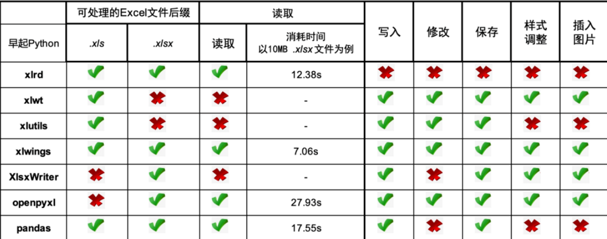
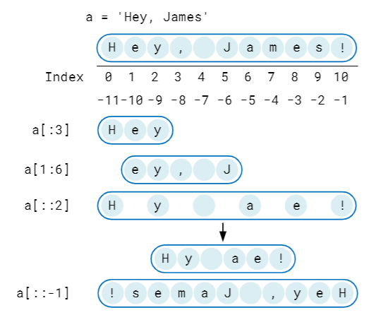
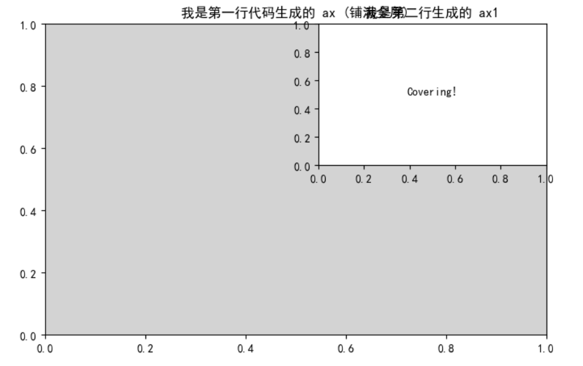
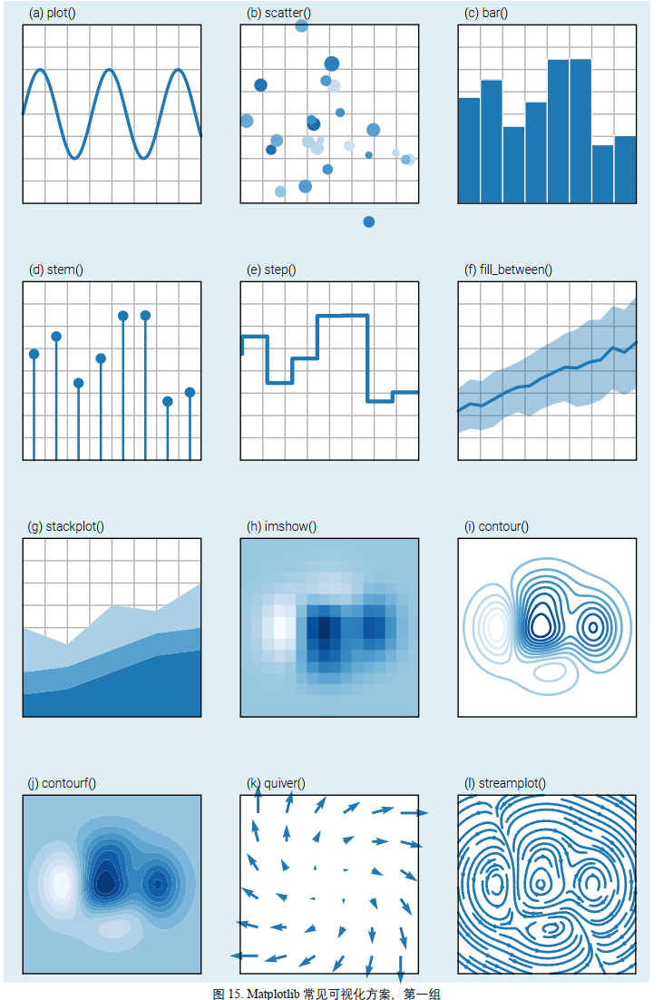
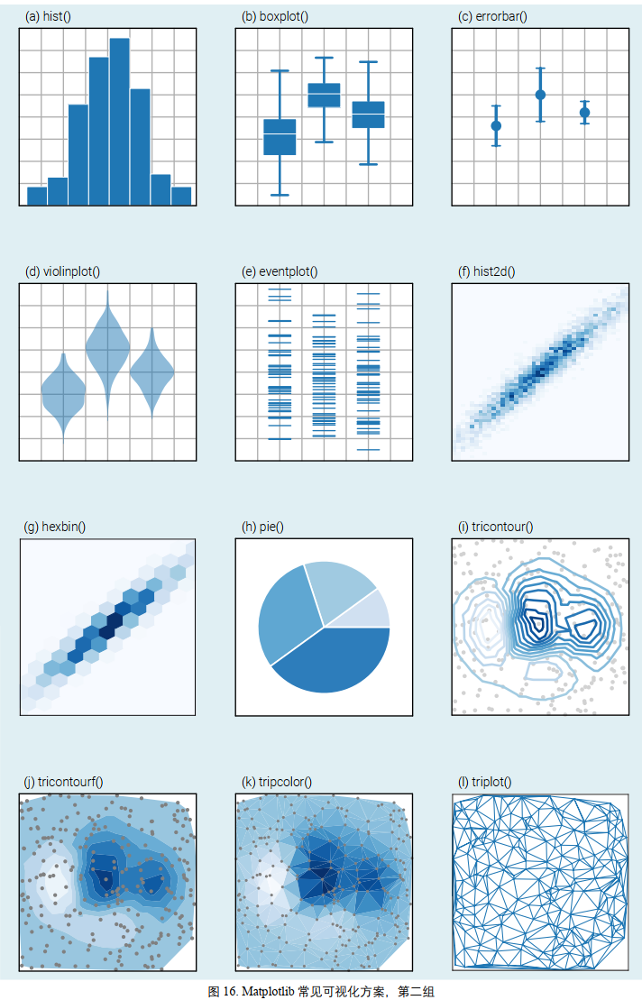
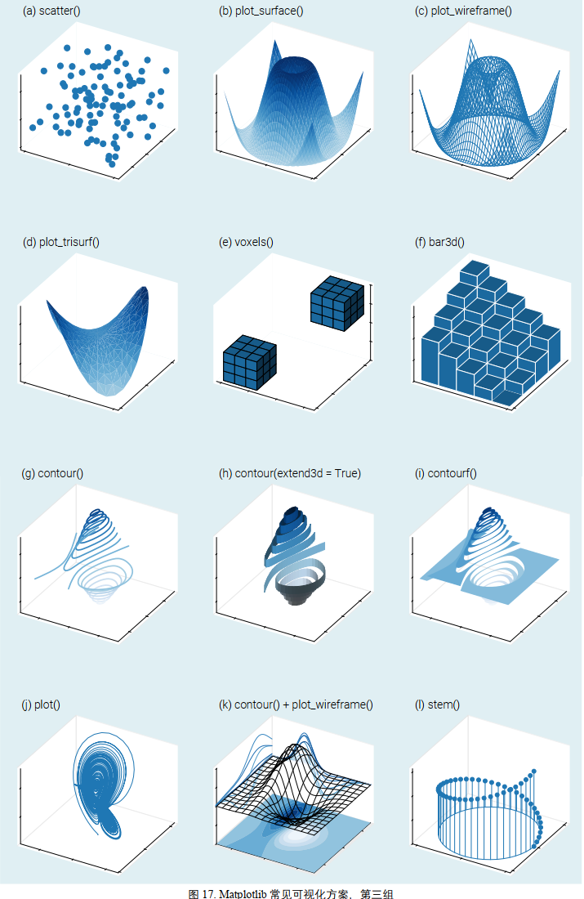

```python
import this

The Zen of Python, by Tim Peters

Beautiful is better than ugly.
Explicit is better than implicit.
Simple is better than complex.
Complex is better than complicated.
Flat is better than nested.
Sparse is better than dense.
Readability counts.
Special cases aren't special enough to break the rules.
Although practicality beats purity.
Errors should never pass silently.
Unless explicitly silenced.
In the face of ambiguity, refuse the temptation to guess.
There should be one-- and preferably only one --obvious way to do it.
Although that way may not be obvious at first unless you're Dutch.
Now is better than never.
Although never is often better than *right* now.
If the implementation is hard to explain, it's a bad idea.
If the implementation is easy to explain, it may be a good idea.
Namespaces are one honking great idea -- let's do more of those!
```
# python环境

- 裸python=python解释器 +pip模块（用来安装库的）
- anaconda=python解释器+conda模块（≈pip+python版本的管理软件）+“预制库 ”
## pip的使用

### 1. 📦 安装与卸载 (Install & Uninstall)

最核心的日常操作。

|**命令**|**说明**|**示例**|
|---|---|---|
|**`pip install [包名]`**|安装最新版本的包|`pip install pandas`|
|**`pip install [包名]==[版本]`**|安装指定版本|`pip install numpy==1.19.2`|
|**`pip install [包名]>=[版本]`**|安装大于等于某版本的包|`pip install "requests>=2.20"`|
|**`pip install --upgrade [包名]`**|升级包到最新版 (简写 `-U`)|`pip install -U pandas`|
|**`pip uninstall [包名]`**|卸载包|`pip uninstall pandas`|
|**`pip uninstall -y [包名]`**|卸载包且不需要确认 (自动 Yes)|`pip uninstall -y pandas`|
|**`python -m pip install -U pip`**|**升级 pip 自身**|(当 pip 提示版本过旧时使用)|

---

### 2. 📝 项目依赖管理 (Requirements)

在部署项目或迁移环境时使用。

|**命令**|**说明**|**示例**|
|---|---|---|
|**`pip freeze > requirements.txt`**|将当前环境所有包导出到文件|用于锁定项目依赖版本|
|**`pip install -r requirements.txt`**|根据文件批量安装包|用于在新环境中部署项目|
|**`pip list --format=freeze`**|以 freeze 格式输出但不保存|查看纯净的包列表|

---

### 3. 🔍 查看与检查 (Inspect & Check)

了解当前环境里装了什么。

|**命令**|**说明**|**示例**|
|---|---|---|
|**`pip list`**|列出已安装的所有包||
|**`pip list --outdated`**|列出所有**有新版本**的包|检查哪些包可以升级|
|**`pip show [包名]`**|显示包的详细信息(路径、依赖)|`pip show numpy`|
|**`pip show -f [包名]`**|显示包安装了哪些具体文件|`pip show -f requests`|
|**`pip check`**|检查已安装包的依赖冲突|用于排查 "Dependency Error"|

---

### 4. 🚀 镜像加速与配置 (Mirrors & Config)

解决国内下载慢的问题。

|**命令**|**说明**|**示例**|
|---|---|---|
|**`-i [URL]`** (临时)|仅本次安装使用指定镜像|`pip install -i https://pypi.tuna.tsinghua.edu.cn/simple pandas`|
|**`pip config set global.index-url [URL]`**|**永久**修改下载源|(见下方推荐源地址)|
|**`pip config list`**|查看当前的配置信息||
|**`pip cache purge`**|清除 pip 的下载缓存|释放磁盘空间|

> **国内常用镜像源 (URL)：**
> 
> - **清华：** `https://pypi.tuna.tsinghua.edu.cn/simple`
>     
> - **阿里：** `https://mirrors.aliyun.com/pypi/simple/`
>     
> - **腾讯：** `https://mirrors.cloud.tencent.com/pypi/simple`
>     

---

### 5. 🛠 特殊参数 (Advanced Flags)

解决特定场景下的棘手问题。

|**参数**|**说明**|**场景**|
|---|---|---|
|**`--user`**|安装到用户目录 (无需 Admin 权限)|解决 `Permission denied` 报错|
|**`--no-cache-dir`**|禁用缓存，强制重新下载|解决安装包损坏或哈希不匹配问题|
|**`--pre`**|允许安装预览版 (Pre-release)|想尝鲜测试版功能时使用|
|**`--proxy [http://ip:port]`**|设置代理服务器|公司内网或特殊网络环境|
|**`--timeout [秒]`**|设置超时时间 (默认 15秒)|网络极差时防止连接断开|

---

### 💡 常见组合技示例

1. **强制重装某个包 (忽略缓存)：**
    
    Bash
    
    ```
    pip install --force-reinstall --no-cache-dir pandas
    ```
    
2. **批量升级所有包 (Linux/Mac)：**
    
    _(Windows 下通常需要写脚本)_
    
    Bash
    
    ```
    pip list --outdated --format=freeze | grep -v '^\-e' | cut -d = -f 1 | xargs -n1 pip install -U
    ```
    
3. **安装本地 `.whl` 文件：**
    
    Bash
    
    ```
    pip install ./Downloads/numpy-1.21.0-cp39-win_amd64.whl
    ```
    

---

**我可以为你做的下一步：**

如果这份速查表对你有帮助，你是否需要我针对 **conda** (Anaconda 的包管理器) 也整理一份类似的速查表，以便对比使用？
## anaconda的使用
anaconda是一个发行版，=python+conda+vscode+pycharm+jupternote+（20w个可以随时使用的库）
channel是anaconda中下载包的源，有defaults和conda-forge还有bioconda等渠道，类似于使用pip时用的清华源
# python基本语法
## 数据类型
## 运算
## 控制结构
## 函数
## 类与对象
# python高级语法


pass

# python如何查找使用模块

- 在哪里找库: 
	- pypi 搜话题就行
	- 问ai
- 都有哪些库，对库的应用进行分类    
	- pypi有topic分类
	- 👉[python常见库](./python常见库.md)
- 找到的库如何研究源代码：
	- 直接查看源文件
	- 在python中打印部分函数，全文，或者__all__，等
	- 使用pydoc查看模块介绍文档等
```bash
# 该用法可以查看所有的模块的文档、函数、类等
python -m pydoc -p 0
# -m 将 `pydoc` 模块作为脚本运行（`pydoc` 是 Python 的标准文档生成/查看工具）
# -p 指定启动 HTTP 服务器模式，0 表示让系统自动分配一个可用端口
```
- 如何查看依赖
- 自定义模块

# python常见模块cheat sheet

### 1. 🐍 内置函数 (Built-in Functions)

无需 `import`，任何地方都能直接用。
#### 🔢 数学与数字 (Math & Numbers)

|**函数**|**说明**|**示例**|
|---|---|---|
|**`abs(x)`**|绝对值|`abs(-5) -> 5`|
|**`round(x, n)`**|四舍五入 (保留 n 位)|`round(3.14159, 2) -> 3.14`|
|**`pow(x, y)`**|x 的 y 次方|`pow(2, 3) -> 8`|
|**`divmod(x, y)`**|返回 (商, 余数)|`divmod(10, 3) -> (3, 1)`|
|**`sum(iterable)`**|求和|`sum([1, 2, 3]) -> 6`|
|**`min() / max()`**|最小值 / 最大值|`max(5, 1, 9) -> 9`|

#### 🔄 数据类型转换 (Type Conversion)

|**函数**|**说明**|**示例**|
|---|---|---|
|**`int() / float()`**|转整数 / 转浮点|`int("10")`|
|**`str() / bool()`**|转字符串 / 转布尔|`bool(0) -> False`|
|**`list() / tuple()`**|转列表 / 转元组|`list((1,2)) -> [1, 2]`|
|**`set() / dict()`**|转集合 / 转字典|`set([1,1,2]) -> {1, 2}`|
|**`bin() / hex()`**|转二进制 / 转十六进制|`hex(255) -> '0xff'`|

#### 🔁 迭代与循环助手 (Iteration & Looping)

|**函数**|**说明**|**示例 (核心用法)**|
|---|---|---|
|**`range(start, stop)`**|生成序列|`for i in range(5):`|
|**`len(s)`**|获取长度|`len("hello") -> 5`|
|**`enumerate(seq)`**|同时获取 **索引** 和 **值**|`for i, v in enumerate(['a','b']):`|
|**`zip(a, b)`**|将两个列表打包成对|`zip([1,2], ['a','b'])`|
|**`sorted(seq)`**|**返回**排序后的新列表|`sorted([3,1,2]) -> [1,2,3]`|
|**`reversed(seq)`**|反转迭代器|`list(reversed([1,2,3]))`|
|**`map(func, seq)`**|对所有元素执行 func|`map(str, [1, 2, 3])`|
|**`filter(func, seq)`**|过滤保留 True 的元素|`filter(lambda x: x>5, data)`|

#### 🕵️ 对象检查与逻辑 (Inspection & Logic)

|**函数**|**说明**|**示例**|
|---|---|---|
|**`type(obj)`**|查看对象类型|`type(1) is int`|
|**`isinstance(obj, cls)`**|检查类型 (推荐)|`isinstance(1, int) -> True`|
|**`id(obj)`**|对象的内存地址|`id(x)`|
|**`dir(obj)`**|列出对象所有属性/方法|`dir([])` (查看列表的方法)|
|**`help(obj)`**|查看帮助文档|`help(print)`|
|**`all(seq)`**|全为真则 True|`all([True, 1, "yes"])`|
|**`any(seq)`**|只要有一个真则 True|`any([False, 0, "yes"])`|

#### ⌨️ 输入输出 (I/O)

|**函数**|**说明**|**示例**|
|---|---|---|
|**`print(*objects)`**|打印|`print("Hello", end="")`|
|**`input(prompt)`**|获取用户输入|`name = input("Who are you?")`|
|**`open(file, mode)`**|打开文件|`with open("f.txt", "w") as f:`|

---

### 2. 📚 常用标准库模块 (Standard Libraries)

无需 `pip install`，只需 `import` 即可使用。
#### 📂 文件与系统 (File & OS)

- **`os`**: 老牌系统接口。
    
    - `os.listdir()`, `os.mkdir()`, `os.environ.get()`
        
- **`sys`**: 解释器相关。
    
    - `sys.argv` (命令行参数), `sys.path` (导包路径), `sys.exit()`
        
- **`pathlib`** (🌟推荐): 现代化的路径操作，面向对象。
    
    - `Path('folder/file.txt').read_text()`
        
- **`shutil`**: 高级文件操作。
    
    - `shutil.copy()`, `shutil.move()`, `shutil.rmtree()` (删文件夹)
        

#### 📅 时间与日期 (Time & Date)

- **`time`**: 时间戳与休眠。
    
    - `time.time()`, `time.sleep(1)`
        
- **`datetime`**: 复杂的日期处理。
    
    - `datetime.now()`, `timedelta(days=1)` (时间加减)
        

#### 🧮 数据处理与结构 (Data & Structures)

- **`json`**: JSON 序列化。
    
    - `json.dumps()` (转字符串), `json.loads()` (解析字符串)
        
- **`collections`**: 增强型数据结构。
    
    - `Counter` (统计词频), `defaultdict` (带默认值的字典)
    - `defaultdict` 的意思是，访问一个没有对应键的字典会报错，而这个不会，反而会初始化一个键来保存值，不是nltk的字典
        
- **`random`**: 随机数。
    
    - `random.randint(1,10)`, `random.choice(list)`, `random.shuffle(list)`
        
- **`math`**: 高级数学。
    
    - `math.sqrt()`, `math.sin()`, `math.pi`
        

#### 📝 文本与正则 (Text & Regex)

- **`re`**: 正则表达式。
    
    - `re.search()`, `re.findall()`, `re.sub()` (替换)
        
- **`string`**: 字符串常量。
    
    - `string.ascii_lowercase`, `string.digits`
        

#### 🌐 网络与并发 (Network & Concurrency)

- **`urllib.request`**: 发送简单的 HTTP 请求。
    
- **`threading`**: 多线程。
    
- **`subprocess`**: 调用外部命令 (如 git, ls)。
    
    - `subprocess.run(["ls", "-l"])`

- **`http.server`**: 它能在你的电脑上瞬间启动一个简单的 Web 服务器。它会将**当前终端所在的文件夹**作为网站的根目录，把里面的文件展示出来。但是是单线程的
        

#### 🐛 调试与开发 (Debug & Dev)

- **`logging`**: 记录日志 (比 print 好用)。
    
- **`pdb`**: 调试器。
    
    - `import pdb; pdb.set_trace()` (设置断点)
        

---

#### 💡 3 个隐藏的超级技巧

1. **一行代码开启 Web 服务器:**
    
    想快速分享当前文件夹的文件给局域网同事？
    
    
    
    ```Bash
    # 在终端运行
    python -m http.server 8080
    # 可以使用ipconfig查看当前局域网ipv4，然后手机访问192.168.-.-:8080，就能访问当前文件夹了
    # 本地电脑浏览器也可以使用localhost:8080
    ```
    
2. **优雅地打印字典/JSON:**
    
    使用 `pprint` (Pretty Print) 模块。
    
    
    ```Python
    from pprint import pprint
    complex_dict = {'status': 200, 'data': {'users': [{'id': 1, 'name': 'Alice', 'roles': ['admin', 'editor']}, {'id': 2, 'name': 'Bob', 'roles': ['user']}]}, 'message': 'success'}
    pprint(complex_dict)
    ```
    
3. **快速统计列表元素:**
    
    
    ```Python
    from collections import Counter
    words = ['apple', 'banana', 'apple', 'apple']
    print(Counter(words)) 
    # 输出: Counter({'apple': 3, 'banana': 1})
    ```

### 3. 🔥python excel自动化


### 4. 😶‍🌫️string的内置方法

⚠️内置方法是类方法或者对象方法，而不是普通通用的函数，更不是内置模块中的函数。这里是string数据类型的对象实例所使用的方法，比如将str1='string'的首字母大写；内置 String 模块，这是一个标准库，**需要 `import string`** 才能使用。 在现代 Python (3.x) 中，它的主要作用是存储一些**常用的字符集合（常量）**，防止你手动输入出错。  👉[string模块cheat sheet](#4-string模块cheat-sheet)

⚠️由于字符串在 Python 中是**不可变 (Immutable)** 的，请记住：**以下所有修改类的方法，都不会改变原字符串，而是返回一个新的字符串。**

---
#### 🔥string的索引方法


#### 🔥% 占位符格式化

|**% 占位符**|**解释**|**例子**|
|---|---|---|
|**%c**|单个字符|`'The first letter of Python is %c' % 'P'`|
|**%s**|字符串|`'Welcome to the world of %s!' % 'Python'`|
|**%i**|整数|`'Python has %i letters.' % len('Python')`|
|**%f**|浮点数|`number = 1.8888`|
|**%o**|八进制整数|`number = 12; print("%i in octal is %o" % (number, number))`|
|**%e**|科学计数|`number = 12000; print("%i is %.2e" % (number, number))`|

#### 🔥 .format() 常用样式示例

|**样式**|**解释**|**例子**|
|---|---|---|
|**:.2f**|浮点数后两位|`"{:.2f}".format(3.1415926) # '3.14'`|
|**:%**|百分数|`"{:%}".format(3.1415926) # '314.159260%'`|
|**:.2%**|百分数，小数点后两位|`"{:.2%}".format(3.1415926) # '314.16%'`|
|**:.2e**|科学计数|`"{:.2e}".format(3.1415926) # '3.14e+00'`|
|**:,**|千位加逗点|`"{:,}".format(3.1415926*1000) # '3,141.5926'`|

#### 🔠 大小写转换 (Case Conversion)

| **函数**               | **描述**     | **示例**                       | **结果**          |
| -------------------- | ---------- | ---------------------------- | --------------- |
| **`s.lower()`** 🔥   | 转为全小写      | `'Hi'.lower()`               | `'hi'`          |
| **`s.upper()`** 🔥   | 转为全大写      | `'Hi'.upper()`               | `'HI'`          |
| **`s.title()`**      | 单词首字母大写    | `'hello world'.title()`      | `'Hello World'` |
| **`s.capitalize()`** | 仅首字母大写     | `'hello world'.capitalize()` | `'Hello world'` |
| **`s.swapcase()`**   | 大小写反转      | `'Hi'.swapcase()`            | `'hI'`          |
| **`s.casefold()`**   | 强力小写 (多语言) | `'ß'.casefold()`             | `'ss'`          |

#### 🧹 去除空白与清理 (Stripping & Cleaning)

|**函数**|**描述**|**示例**|**结果**|
|---|---|---|---|
|**`s.strip([chars])`** 🔥|去除**两端**空白/字符|`' xy '.strip()`|`'xy'`|
|**`s.lstrip([chars])`**|去除**左端** (Left)|`' xy '.lstrip()`|`'xy '`|
|**`s.rstrip([chars])`**|去除**右端** (Right)|`' xy '.rstrip()`|`' xy'`|
|**`s.removeprefix(fix)`**|(3.9+) 移除**前缀**|`'Mr.A'.removeprefix('Mr.')`|`'A'`|
|**`s.removesuffix(fix)`**|(3.9+) 移除**后缀**|`'test.py'.removesuffix('.py')`|`'test'`|

#### 🔗 拆分与连接 (Splitting & Joining)

|**函数**|**描述**|**示例**|**结果**|
|---|---|---|---|
|**`s.split(sep)`** 🔥|按符拆分为**列表**|`'a b'.split()`|`['a', 'b']`|
|**`s.rsplit(sep)`**|从右开始拆分|`'a b c'.rsplit(None, 1)`|`['a b', 'c']`|
|**`s.splitlines()`** 🔥|按行拆分|`'a\nb'.splitlines()`|`['a', 'b']`|
|**`sep.join(iter)`** 🔥|用符拼接**列表**|`'-'.join(['a', 'b'])`|`'a-b'`|
|**`s.partition(sep)`**|切为3段元组|`'a=1'.partition('=')`|`('a','=','1')`|

#### 🔍 查找与替换 (Search & Replace)

|**函数**|**描述**|**示例**|**结果**|
|---|---|---|---|
|**`s.find(sub)`** 🔥|找索引 (失败返 -1)|`'hi'.find('i')`|`1`|
|**`s.index(sub)`**|找索引 (失败**报错**)|`'hi'.index('x')`|`Error`|
|**`s.count(sub)`** 🔥|统计出现次数|`'aa'.count('a')`|`2`|
|**`s.replace(o, n)`** 🔥|替换文本|`'1-1'.replace('-',':')`|`'1:1'`|
|**`s.startswith(pre)`**|检查开头|`'abc'.startswith('a')`|`True`|
|**`s.endswith(suf)`** 🔥|检查结尾|`'pic.jpg'.endswith('.jpg')`|`True`|

#### 🧐 内容判断 (Inspection / Is...)

|**函数**|**描述**|**示例**|**结果**|
|---|---|---|---|
|**`s.isalpha()`**|全为字母 (含汉字)|`'abc'`|`True`|
|**`s.isdigit()`** 🔥|全为数字|`'123'`|`True`|
|**`s.isalnum()`**|字母或数字|`'a1'`|`True`|
|**`s.isspace()`**|全为空白符|`' \t'`|`True`|
|**`s.islower()`**|全为小写|`'abc'`|`True`|
|**`s.isupper()`**|全为大写|`'ABC'`|`True`|
|**`s.istitle()`**|单词首字母大写|`'The End'`|`True`|

#### 📏 格式化与对齐 (Formatting & Alignment)

|**函数**|**描述**|**示例**|**结果**|
|---|---|---|---|
|**`s.center(w)`**|居中|`'A'.center(3)`|`' A '`|
|**`s.ljust(w)`**|左对齐|`'A'.ljust(3)`|`'A '`|
|**`s.rjust(w)`**|右对齐|`'A'.rjust(3)`|`' A'`|
|**`s.zfill(w)`**|右对齐补零|`'5'.zfill(3)`|`'005'`|
|**`f"{var}"`** 🔥|f-string (推荐)|`f'Hi {name}'`|`'Hi Py'`|

#### 🔄 编码 (Encoding)

|**函数**|**描述**|**示例**|**结果**|
|---|---|---|---|
|**`s.encode()`**|Str ➡ Bytes|`'Hi'.encode('utf8')`|`b'Hi'`|
|**`b.decode()`**|Bytes ➡ Str|`b'Hi'.decode('utf8')`|`'Hi'`|

---

#### 💡 核心易错点

- ❌ **误区**：`string.upper()` 会改变原变量。
    
    - ✅ **真相**：字符串不可变，必须赋值：`s = s.upper()`
        
- ❌ **误区**：`list.join('-')`
    
    - ✅ **真相**：分隔符在前面：`'-'.join(list)`
        
- ❌ **误区**：`find` 找不到会报错。
    
    - ✅ **真相**：`find` 返回 `-1` (安全)，`index` 才会报错。
  
### string模块cheat sheet

虽然现代 Python 中大部分“动作”都移到了内置的字符串方法里，但 `string` 模块依然是处理**字符集常量**和**模板替换**的神器，特别是在涉及**密码生成、数据清洗、安全格式化**等进阶场景时。

记得先导入：`import string`

---
#### 1. 🧱 常用字符常量 (Constants)

这些是构建验证码、密码生成器或数据清洗规则的“原材料”。

| **常量名**                       | **描述**         | **内容 (部分展示)**            |
| ----------------------------- | -------------- | ------------------------ |
| **`string.ascii_letters`** 🔥 | 所有英文字母 (大小写)   | `'abcdef...WZ'`          |
| **`string.ascii_lowercase`**  | 所有小写字母         | `'abcdef...z'`           |
| **`string.ascii_uppercase`**  | 所有大写字母         | `'ABCDEF...Z'`           |
| **`string.digits`** 🔥        | 所有数字字符         | `'0123456789'`           |
| **`string.hexdigits`**        | 十六进制字符         | `'0123...abc...ABC...F'` |
| **`string.octdigits`**        | 八进制字符          | `'01234567'`             |
| **`string.punctuation`** 🔥   | 所有标点符号         | `'!"#$%&\'()*+,-./...'`  |
| **`string.whitespace`**       | 所有空白符 (含换行/制表) | `' \t\n\r\x0b\x0c'`      |
| **`string.printable`**        | 所有可打印字符        | (包含以上所有 + 空格)            |

---

#### 2. 🛠️ 实用工具与类 (Utilities & Classes)

除了常量，这里还有几个鲜为人知但好用的工具。

|**名称**|**类型**|**描述**|**示例**|
|---|---|---|---|
|**`string.capwords(s)`**|函数|智能标题化 (分割->首字母大写->合并)|`string.capwords('hi py')` ➡ `'Hi Py'`|
|**`string.Template`** 🛡️|类|**安全**的字符串替换 (使用 `$` 符)|(见下方进阶用法)|

> **💡 提示：** `capwords` 和内置方法 `.title()` 的区别在于：`capwords` 会先用 `split()` 归一化空格，这在处理不规则空格文本时更干净。

---

####  3. 🚀进阶用法 (Advanced Usage)

这里展示 3 个 `string` 模块最强大的实战场景，这也是区分新手和高手的关键。

##### 场景 A: ⚡ 极速数据清洗 (去除所有标点)

比写正则 (Regex) 更快、更易读的清洗方式。

```Python
import string

text = "Hello, World! (Python 3.9+)"
# 1. 获取所有标点
exclude = string.punctuation 
# 2. 创建映射表：将标点映射为 None (即删除)
table = str.maketrans('', '', exclude)
# 3. 极速转换
clean_text = text.translate(table)

print(clean_text) 
# 结果: "Hello World Python 39"
```

##### 场景 B: 🛡️ 安全的字符串替换 (Template)

当格式化字符串来自**用户输入**时，使用 f-string 或 `.format()` 可能导致程序崩溃或安全注入。`Template` 是更安全的选择。

```Python
from string import Template

# 模板使用 $ 符号，而不是 {}
tpl = Template('Hi $name, welcome to $site!')

# 1. 正常替换 (substitute)
print(tpl.substitute(name='Bob', site='Github'))
# 结果: Hi Bob, welcome to Github!

# 2. 安全替换 (safe_substitute) - 🔥 核心卖点
# 如果缺少 key，.format() 会报错，但这里会保留原样！
print(tpl.safe_substitute(name='Alice')) 
# 结果: Hi Alice, welcome to $site!  <-- 不会报错崩溃
```

##### 场景 C: 🔐 随机密码/验证码生成

结合 `secrets` (比 `random` 更安全) 和 `string` 常量。

```Python
import string
import secrets  # Python 3.6+ 推荐用于安全生成

# 定义密码字符库：字母 + 数字 + 标点
alphabet = string.ascii_letters + string.digits + string.punctuation

# 生成 12 位高强度密码
password = ''.join(secrets.choice(alphabet) for i in range(12))

print(password)
# 结果示例: mK$9d#f2@Lp1
```

---

#### 🆚 核心对比：Template vs f-string

|**特性**|**f-string / .format()**|**string.Template**|
|---|---|---|
|**语法**|`f"Hello {name}"`|`Template("Hello $name")`|
|**性能**|⭐⭐⭐⭐⭐ (极快)|⭐⭐⭐ (稍慢)|
|**灵活性**|高 (支持表达式 `f"{a+1}"`)|低 (仅支持简单变量替换)|
|**容错性**|低 (缺变量会报错 `KeyError`)|**高** (用 `safe_substitute` 可忽略缺失)|
|**适用场景**|内部开发代码|**处理外部用户输入的模板** (如邮件模版)|


###  math模块cheat sheet

###  random模块cheat sheet
### stastics模块cheat sheet
### copy模块cheat sheet
###  os、sys模块cheat sheet

###  numpy模块cheat sheet
###  pandas模块cheat sheet

### matplotlib模块cheat sheet

> - matplotlib 画所有图
> - plotly 画交互的图
> - seaborn 画跟统计学有关的图更方便

> 核心理念：**Figure** (画布) 是底座，**Axes** (坐标系) 是画纸。尽量操作 Axes。
> 记得先导入：`import matplotlib.pyplot as plt`

---
#### 1. 🏗️ 核心架构 (The OO Pattern)

别再只用 `plt.plot()` 了！使用 `fig, ax` 模式能让你精准控制图表的每一个细节。

```Python

#  1.黄金起手式用法
fig, (ax1,ax2) = plt.subplots(1,2,figsize=(6,3))          # 默认 1×1
ax1.plot(x1_array,sin_array);ax1.grid()                   # 所有的绘图都在 ax 上进行
ax2.plot(x2_array,exp_array);ax2.grid()
# plt.tight_layout()
fig.suptitle('Main Title')
ax1.set_title('sin函数')
plt.show()


#  2.原始用法
plt.figure(figsize=(8, 6)) #第1个窗口可以不显式创建figure，但第二个窗口就必须显式创建一个Figure
plt.subplot(2, 1, 1)             # 1. 激活第 1 个子图 (2行1列布局)
plt.plot(x,y,marker='.',markersize=8)    # xy是两个数列list
plt.text(0,0,'0')
plt.text(2*math.pi,0,r'$2\pi$')
ax = plt.gca()
ax.spines['top'].set_visible(False)
ax.spines['right'].set_visible(False)
plt.subplot(2, 1, 2)              # 2. 激活第 2 个子图
plt.plot([1, 2, 3], [3, 2, 1]) 
plt.title("Plot 2")
plt.figure(figsize=(5, 3)) 
plt.plot([1, 2, 3, 4], [10, 20, 15, 30], 'r--') 
plt.show()

#  3.折中用法，使用黄金起手式，但是后面的函数使用pyplot默认函数
# plt.sca & plt.gca 的用法：set/get current axe: 让当前的ax成为plt的“当前”的轴
fig, (ax1, ax2) = plt.subplots(1, 2)   # 两个子图
plt.sca(ax2)                           # 先让右边成为“当前”轴
plt.plot([0, 1], [0, 1], 'r')          # 画在 ax2
plt.sca(ax1)                           # 再切到左边
plt.plot([0, 1], [0, 1], 'b')          # 画在 ax1
plt.show()

#  4.先生成画布，再添加图的用法
fig = plt.figure(figsize=(6,3))
# fig2= plt.figure()# 可以同时存在多个图，每个图都是一个窗口
ax1 = fig.add_subplot(1, 1, 1)
ax2= fig.add_subplot(1, 2, 2) # 也能这么操作，效果图如图
ax1.plot(x, y)
ax2.plot(x, z)
```


| **功能**      | import matplotlib.pyplot as plt   | fig, ax = plt.subplots()         |
| ----------- | --------------------------------- | -------------------------------- |
| **创建新的图形**  | `plt.figure()`                    | `plt.figure()`\ `plt.subplots()` |
| **创建新的子图**  | `plt.subplot()`!=`plt.subplots()` | `ax = fig.add_subplot()`         |
| **创建折线图**   | `plt.plot()`                      | `ax.plot()`                      |
| **添加横轴标签**  | `plt.xlabel()`                    | `ax.set_xlabel()`                |
| **添加纵轴标签**  | `plt.ylabel()`                    | `ax.set_ylabel()`                |
| **添加标题**    | `plt.title()`                     | `ax.set_title()`                 |
| **设置横轴范围**  | `plt.xlim()`                      | `ax.set_xlim()`                  |
| **设置纵轴范围**  | `plt.ylim()`                      | `ax.set_ylim()`                  |
| **添加图例**    | `plt.legend()`                    | `ax.legend()`                    |
| **添加文本注释**  | `plt.text()`                      | `ax.text()`                      |
| **添加注释**    | `plt.annotate()`                  | `ax.annotate()`                  |
| **添加水平线**   | `plt.axhline()`                   | `ax.axhline()`                   |
| **添加垂直线**   | `plt.axvline()`                   | `ax.axvline()`                   |
| **添加背景网格**  | `plt.grid()`                      | `ax.grid()`                      |
| **保存图形到文件** | `plt.savefig()`                   | `fig.savefig()`                  |

---

#### 2. 📈 常用图表类型 (Plot Types)

均假设 `fig, ax = plt.subplots()` 已创建。

| **方法**                | **描述**   | **示例代码**            | **关键参数**                                    |
| --------------------- | -------- | ------------------- | ------------------------------------------- |
| **`ax.plot()`** 🔥    | 折线图      | `ax.plot(x, y)`     | `linestyle='--'`, `marker='o'`              |
| **`ax.scatter()`** 🔥 | 散点图      | `ax.scatter(x, y)`  | `s=size`, `c=color`, `alpha=0.5`            |
| **`ax.bar()`**        | 柱状图 (竖直) | `ax.bar(x, height)` | `width=0.8`, `color='b'`                    |
| **`ax.barh()`**       | 条形图 (水平) | `ax.barh(y, width)` | `height=0.5`                                |
| **`ax.hist()`**       | 直方图 (分布) | `ax.hist(data)`     | `bins=20`, `density=True`                   |
| **`ax.boxplot()`**    | 箱线图 (统计) | `ax.boxplot(data)`  | `vert=False` (水平箱线)                         |
| **`ax.imshow()`**     | 热力图/图片   | `ax.imshow(matrix)` | `cmap='viridis'`, `interpolation='nearest'` |
| **`ax.pie()`**        | 饼图       | `ax.pie(sizes)`     | `autopct='%1.1f%%'`, `explode=[0.1, 0]`     |


|                                           |                                           |
| ----------------------------------------- | ----------------------------------------- |
|  | |

---

#### 3. 🎨 装饰与美化 (Styling & Labeling)

注意：在 OO 模式下，很多命令变成了 `set_` 开头。

| **目标** | **OO 模式命令 (ax.xxx)**        | **说明**                          |
| ------ | --------------------------- | ------------------------------- |
| **标题** | `ax.set_title("Text")`      | 设置图表标题                          |
| **标签** | `ax.set_xlabel("X Label")`  | 设置 X/Y 轴名称                      |
| **范围** | `ax.set_xlim(0, 10)`        | 设置轴的显示范围                        |
| **刻度** | `ax.set_xticks([0, 5, 10])` | 自定义刻度位置                         |
| **网格** | `ax.grid(True)`             | 显示网格线 (`linestyle=':'`)         |
| **图例** | `ax.legend(loc='best')` 🔥  | **必须先在 plot 里加 `label='name'`** |
| **文本** | `ax.text(x, y, "Note")`     | 在指定坐标写字                         |
| **箭头** | `ax.annotate(...)`          | (见下方进阶用法)                       |


---

#### 4. 🖼️ 多子图布局 (Subplots Layout)

在一张图上画多个表。

```Python
# 创建 2行 2列 的布局
fig, axes = plt.subplots(nrows=2, ncols=2, figsize=(10, 8))

# axes 现在是一个二维数组，通过索引访问
ax1 = axes[0, 0]  # 左上
ax2 = axes[0, 1]  # 右上
ax3 = axes[1, 0]  # 左下
ax4 = axes[1, 1]  # 右下

ax1.plot(x, y)
ax2.scatter(x, y)

# 🔥 神技：自动调整布局防止重叠
plt.tight_layout()
```

---

####  5. 🚀 进阶用法 (Advanced & Pro Tips)

##### 场景 A: 🇨🇳 解决中文乱码 (Chinese Support)

Matplotlib 默认不支持中文，这是新手必坑。

```Python
plt.rcParams['font.sans-serif'] = ['SimHei'] # 用来正常显示中文标签
plt.rcParams['axes.unicode_minus'] = False   # 用来正常显示负号
```

##### 场景 B: 🏷️ 高级标注 (Annotation)

比 `text` 更高级，带箭头指向

```Python
ax.annotate('Look Here!', 
            xy=(2, 5),             # 箭头指向的点
            xytext=(3, 7),         # 文字所在点
            arrowprops=dict(facecolor='black', shrink=0.05))
```

##### 场景 C: 👯‍♂️ 双坐标轴 (Dual Axis)

两个数据量级完全不同（比如 温度 vs 降雨量）画在同一张图。

```Python
ax1 = plt.gca()          # 获取当前轴
ax2 = ax1.twinx()        # 🔥 镜像出一个共享X轴的新轴

ax1.plot(x, y1, 'g-')    # 左轴画绿线
ax2.plot(x, y2, 'b-')    # 右轴画蓝线

ax1.set_ylabel('Temp')
ax2.set_ylabel('Rain')
```

##### 场景 D: 💾 保存图片 (Saving)

不要截图，用代码存，清晰度无限高。

```Python
# dpi: 分辨率 (300 用于打印)
# bbox_inches: 'tight' 剪掉周围多余白边
plt.savefig('my_plot.png', dpi=300, bbox_inches='tight', transparent=True)
```

##### 场景 E: 💅 一键美颜 (Style Sheets)

觉得自己配色丑？用内置主题。

```Python
# 查看所有可用风格
# print(plt.style.available)

# 使用像 R语言 ggplot 的风格
plt.style.use('ggplot') 

# 或者暗黑模式
# plt.style.use('dark_background')
```

---
#### 6. 🚀 进阶的进阶用法

这里就不一一展开介绍用法和cheatsheet了，要不然文本就太臃肿了（本来就很臃肿了😬）👉[python cheatsheet Vault](python_Cheatsheet_vault.md)

| **子模块**                       | **常见用途** | **示例场景**                                   |
| ----------------------------- | -------- | ------------------------------------------ |
| **`matplotlib.image`**        | 图像处理     | 读取和显示图片文件 (`mpimg.imread`)                 |
| **`matplotlib.animation`**    | 制作动画     | 让图表动起来，生成 GIF 或 MP4                        |
| **`matplotlib.colors`**       | 颜色映射     | 制作热力图时自定义渐变色 (`LogNorm`, `ListedColormap`) |
| **`matplotlib.ticker`**       | 刻度控制     | 比如要把坐标轴刻度变成 "$10,000" 这种格式                 |
| **`matplotlib.dates`**        | 日期处理     | 专门处理时间序列坐标轴                                |
| **`matplotlib.font_manager`** | 字体管理     | 手动加载特殊的 .ttf 字体文件                          |
| **`matplotlib.patches`**      | 绘制形状     | 手动画圆、矩形、多边形（在图上做标记）                        |

### plotly模块cheat sheet

### sympy模块cheat sheet


# python实战

- 算法竞赛和数据结构
- 数学建模与物理建模
- 软件设计
	- .py+bat文件一键运行
		- 批处理文件：@echo off 是组合拳，@ 隐藏 echo off 本身，echo off 再关闭后续所有命令的显示。（就是C:\Users\rabitsir\Desktop>git这一行）
	- pyinstaller生成exe文件、Nuitka将python转成c/c++再编译但速度慢、~~cx_Freeze类似PyInstaller~~
		- pyinstaller -F -w -I icon.ico demo.py  `-F` 让程序变成单个文件，`-w` 让程序运行时不弹黑框
	- python命令行程序？
		- 之前的哪个程序搞得能运行就行
		- 看看其他有名的命令行程序的代码，造个轮子？还是就学学改进一下之前那个程序然后用python重写也行，主要之后不发展这个技术
	- gui软件开发框架
		- Electron（js）
		- Qt（c/python）
- **Windows app开发技术**
	- 原生
		- Win32api
		- Mfc
		- ~~Maui 跨平台~~
		- ~~Uwp（被winui3代替而废除）/winui3 未来方向，桌面端~~
		- ~~Wpf 成熟，桌面端~~
	- 跨平台
		- [x] Qt
		- Flutter google系 比maui好用，但综合下来没qt好
	- web套壳
		- [x] Electron
		- Cef与electron都基于Chromium
- **Python app 开发**
	- 桌面 APP
		- Pyside Qt 官方 Python
		- Pyqt
		- Tkinter标准库 自带，无需安装 但界面非常“老旧”
		- Kivy
		- PyGObject（GTK）Linux 下非常强GNOME 桌面同款不如 Qt 跨平台
	- 手机 APP（Android / iOS）
		- Kivy / KivyMD
		- PySide6
	- **Web APP**
		- **Flask/FastAPI 小型网站 / API 后端首选**
		- **Django 适合大型网站**
		- **Streamlit**
	- ~~跨平台 UI~~
		- ~~Flet（Flutter 的 Python 封装）~~
	- ~~图形 / 游戏类 APP~~
		- ~~PyGame 2D 游戏最经典~~
		- ~~Arcade 更现代的 2D 游戏框架~~
		- ~~Panda3D~~
		- ~~Godot + Python API~~
	- ~~命令行 APP（CLI 工具）~~
		- ~~click~~
		- ~~typer~~
		- ~~argparse（标准库）~~

